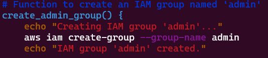
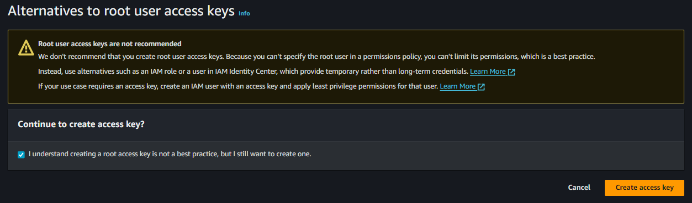
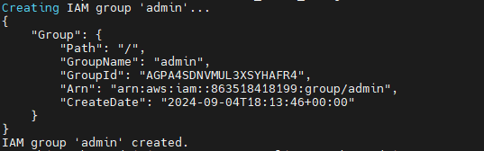

# Capstone Project #5: Shell Script for AWS IAM Management

## Project Scenario
Datawise Solutions requires an efficient management of their AWS IAM. I am tasked to write a shell script for its team that needs to onboard five new employees to access AWS resources securely. 

## Objectives
1. Script enhancement
2. Define IAM user names array
3. Create IAM users.
4. Create IAM group.
5. Attach administrative policy to group.
6. Assign users to group.

## Step 1: Prepare the documentation

# Tasks

1. Created the file `aws_cloud_manager.sh`

2. Gave the file execute permission

3. Ensure they have AWS CLI imstalled 

4. Create an array for the employees to be onboarded

5. Create admin group 

6. Attach the admin group to the admin policy 

7. Create the users to be onboarded

8. Add all the created users to the admin group

9. Attache the admnin policy to the admin group created

10. Onboard the users

## Step 2: Set up the Server and deploy

1. Launch an EC2 instance 

2. Install, setup and enable Apache server 

3. Install AWS CLI

4. Create access key on IAM AWS

5. Configure the access key to the apache server

6. Create the file for the shell script

7. Grant the file permission to be executable 

8. Vim into the file and paste the code 

9. Run the shell script to carry out the script

10. Script running perfectly. Creating admin group

11. Attaching the admin policy to the `admin` group

12. Script creating the users `empployee1`

13. Script is adding the `employee1` to the admin group

14. Script creating `employees 2,3,4,& 5`

15. Script successfully completed the onboarding process

## Step 3: Confirm Onboarding on the AWS instance

1. Confirm group creation 

2. All employees successfully added to group

3. All employees having admin policy

