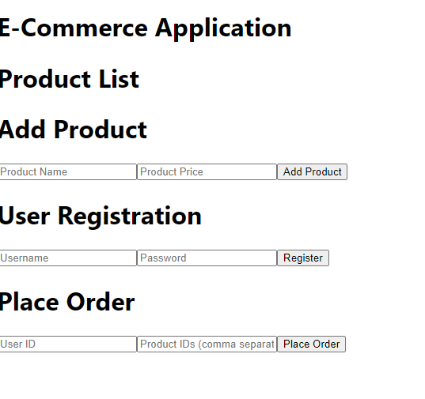
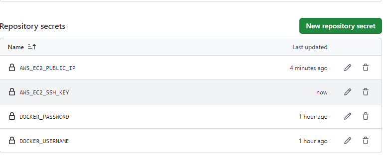

# Capstone Project #8: E-Commerce Application CI/CD Pipeline

## Project Scenario
I am tasked with developing and maintaining an e-commerce platform. The platform should have 2 primary components:
1. E-Commerce API: backend service handling porducts listings, user accounts, and order processing. 
2. E-Commerce Frontend: a web applicaotion for users to browse prodcuts, manage their accounts, and place orders. 

The goal is to automate the integration and deployment process for both components using Github Actions, ensuring continuous delivery and integration.

## Steps:
### 1. Project Setup

a. Create the directories

```markdown
mkdir 08.E-Commerce_Application_CICD_Pipeline
```

```markdown
mkdir api
```

```markdown
mkdir webapp
```

### 2. Initialize Github Actions

a. Create `.github/workflows` directory in my repository for Github Actions.

```markdown
mkdir .github/workflows
```

### 3. Backend API Setup

a. Install node.js, nvm and express
```markdown
# installs fnm (Fast Node Manager)
curl -fsSL https://fnm.vercel.app/install | bash

# activate fnm
source ~/.bashrc

# download and install Node.js
fnm use --install-if-missing 20

# verifies the right Node.js version is in the environment
node -v # should print `v20.17.0`

# verifies the right npm version is in the environment
npm -v # should print `10.8.2`
```

```markdown
npm install express body-parser
```
```markdown
npm init -y #sets up package.json dependencies
```

b. Set up a Node.js/Express application that handles basic e-commerce operations. 

```markdown
touch app.js
```

```markdown
import express from 'express';
import bodyParser from 'body-parser';

const app = express();
const port = 3000;

// Middleware
app.use(bodyParser.json());
app.use(bodyParser.urlencoded({ extended: true }));

// In-memory data stores (simulating a database)
let products = [];
let users = [];
let orders = [];

// Routes
// List products
app.get('/products', (req, res) => {
  res.json(products);
});

// Add a new product
app.post('/products', (req, res) => {
  const { name, price } = req.body;
  if (!name || !price) {
    return res.status(400).json({ error: 'Name and price are required' });
  }
  const newProduct = { id: products.length + 1, name, price };
  products.push(newProduct);
  res.status(201).json(newProduct);
});

// Register a new user
app.post('/users', (req, res) => {
  const { username, password } = req.body;
  if (!username || !password) {
    return res.status(400).json({ error: 'Username and password are required' });
  }
  const newUser = { id: users.length + 1, username, password };
  users.push(newUser);
  res.status(201).json(newUser);
});

// Place an order
app.post('/orders', (req, res) => {
  const { userId, productIds } = req.body;
  if (!userId || !productIds || !Array.isArray(productIds)) {
    return res.status(400).json({ error: 'User ID and product IDs are required' });
  }
  const newOrder = { id: orders.length + 1, userId, productIds };
  orders.push(newOrder);
  res.status(201).json(newOrder);
});

// Start the server
app.listen(port, () => {
  console.log(`Server is running at http://localhost:${port}`);
});

export default app;


```

c. Implement Unit tests for the api. I did this by using mocha and chai.

```markdown
npm install --save-dev mocha chai supertest
```
```markdown
mkdir test
touch test/app.test.js
```

```markdown
import { expect } from 'chai';
import supertest from 'supertest';
import app from '../app.js'; // Ensure the path and file extension are correct

const request = supertest(app);

describe('E-commerce API', () => {
  describe('GET /products', () => {
    it('should return a list of products', (done) => {
      request.get('/products')
        .expect('Content-Type', /json/)
        .expect(200, done);
    });
  });

  describe('POST /products', () => {
    it('should add a new product', (done) => {
      const newProduct = { name: 'Test Product', price: 10 };
      request.post('/products')
        .send(newProduct)
        .expect('Content-Type', /json/)
        .expect(201)
        .expect((res) => {
          expect(res.body).to.have.property('name', 'Test Product');
          expect(res.body).to.have.property('price', 10);
        })
        .end(done);
    });
  });

  describe('POST /users', () => {
    it('should register a new user', (done) => {
      const newUser = { username: 'testuser', password: 'password123' };
      request.post('/users')
        .send(newUser)
        .expect('Content-Type', /json/)
        .expect(201)
        .expect((res) => {
          expect(res.body).to.have.property('username', 'testuser');
        })
        .end(done);
    });
  });

  describe('POST /orders', () => {
    it('should place an order', (done) => {
      const newOrder = { userId: 1, productIds: [1] };
      request.post('/orders')
        .send(newOrder)
        .expect('Content-Type', /json/)
        .expect(201)
        .expect((res) => {
          expect(res.body).to.have.property('userId', 1);
          expect(res.body).to.have.property('productIds').that.deep.equals([1]);
        })
        .end(done);
    });
  });
});
```
```markdown
npm install esm
```

```markdown
npm test
```

### 4. Frontend Web App Setup

a. Create a simple react app that interacts with the backend API ensuring it has product listing, user login and order placement.

```markdown
npx create-react-app . #creates a new React application
```
```markdown
npm install axios  #axios is a popular HTTP client for making requests
```

b. Set up components for ProductList.js, AddProduct.js, UserRegistration.js and PlaceOrder.js

ProductList.js

```markdown
mkdir src/components/ProductList.js
```

```markdown
import React, { useState, useEffect } from 'react';
import axios from 'axios';

const ProductList = () => {
  const [products, setProducts] = useState([]);

  useEffect(() => {
    axios.get('http://localhost:3000/products')
      .then(response => setProducts(response.data))
      .catch(error => console.error('Error fetching products:', error));
  }, []);

  return (
    <div>
      <h1>Product List</h1>
      <ul>
        {products.map(product => (
          <li key={product.id}>{product.name} - ${product.price}</li>
        ))}
      </ul>
    </div>
  );
};

export default ProductList;
```
AddProduct.js

```markdown
mkdir src/components/AddProduct.js
```

```markdown
import React, { useState } from 'react';
import axios from 'axios';

const AddProduct = () => {
  const [name, setName] = useState('');
  const [price, setPrice] = useState('');

  const handleSubmit = (e) => {
    e.preventDefault();
    axios.post('http://localhost:3000/products', { name, price })
      .then(response => {
        console.log('Product added:', response.data);
        setName('');
        setPrice('');
      })
      .catch(error => console.error('Error adding product:', error));
  };

  return (
    <div>
      <h1>Add Product</h1>
      <form onSubmit={handleSubmit}>
        <input
          type="text"
          value={name}
          onChange={(e) => setName(e.target.value)}
          placeholder="Product Name"
          required
        />
        <input
          type="number"
          value={price}
          onChange={(e) => setPrice(e.target.value)}
          placeholder="Product Price"
          required
        />
        <button type="submit">Add Product</button>
      </form>
    </div>
  );
};

export default AddProduct;
```
UserRegistration.js

```markdown
mkdir src/components/UserRegistration.js
```

```markdown
import React, { useState } from 'react';
import axios from 'axios';

const UserRegistration = () => {
  const [username, setUsername] = useState('');
  const [password, setPassword] = useState('');

  const handleSubmit = (e) => {
    e.preventDefault();
    axios.post('http://localhost:3000/users', { username, password })
      .then(response => {
        console.log('User registered:', response.data);
        setUsername('');
        setPassword('');
      })
      .catch(error => console.error('Error registering user:', error));
  };

  return (
    <div>
      <h1>User Registration</h1>
      <form onSubmit={handleSubmit}>
        <input
          type="text"
          value={username}
          onChange={(e) => setUsername(e.target.value)}
          placeholder="Username"
          required
        />
        <input
          type="password"
          value={password}
          onChange={(e) => setPassword(e.target.value)}
          placeholder="Password"
          required
        />
        <button type="submit">Register</button>
      </form>
    </div>
  );
};

export default UserRegistration;
```
PlaceOrder.js

```markdown
mkdir src/components/PlaceOrder.js
```

```markdown
import React, { useState } from 'react';
import axios from 'axios';

const PlaceOrder = () => {
  const [userId, setUserId] = useState('');
  const [productIds, setProductIds] = useState('');

  const handleSubmit = (e) => {
    e.preventDefault();
    axios.post('http://localhost:3000/orders', { userId, productIds: productIds.split(',').map(id => parseInt(id)) })
      .then(response => {
        console.log('Order placed:', response.data);
        setUserId('');
        setProductIds('');
      })
      .catch(error => console.error('Error placing order:', error));
  };

  return (
    <div>
      <h1>Place Order</h1>
      <form onSubmit={handleSubmit}>
        <input
          type="number"
          value={userId}
          onChange={(e) => setUserId(e.target.value)}
          placeholder="User ID"
          required
        />
        <input
          type="text"
          value={productIds}
          onChange={(e) => setProductIds(e.target.value)}
          placeholder="Product IDs (comma separated)"
          required
        />
        <button type="submit">Place Order</button>
      </form>
    </div>
  );
};

export default PlaceOrder;
```

c. Update the `src/App.js` to include the components

```markdown
import React from 'react';
import ProductList from './components/ProductList';
import AddProduct from './components/AddProduct';
import UserRegistration from './components/UserRegistration';
import PlaceOrder from './components/PlaceOrder';

const App = () => {
  return (
    <div>
      <h1>E-Commerce Application</h1>
      <ProductList />
      <AddProduct />
      <UserRegistration />
      <PlaceOrder />
    </div>
  );
};

export default App;
```

### 5. Continuous Integration Workflow

a. Write a backend and frontend github action workflow that: installs dependencies, runs test and builds the application.

Node.js Backend Workflow

```markdown
mkdir .github/workflows/node.js-backend.yml
```
```markdown
# .github/workflows/node.js-backend.yml
name: Backend CI

on:
  push:
    branches:
      - main
  pull_request:
    branches:
      - main

jobs:
  build:
    runs-on: ubuntu-latest
    steps:
      - name: Checkout code
        uses: actions/checkout@v3

      - name: Set up Node.js
        uses: actions/setup-node@v3
        with:
          node-version: '16' # Specify the Node.js version you are using

      - name: Install dependencies
        run: npm install
        working-directory: ./backend # Adjust to your backend directory if needed

      - name: Run tests
        run: npm test
        working-directory: ./backend # Adjust to your backend directory if needed

      - name: Build application
        run: npm run build
        working-directory: ./backend # Adjust to your backend directory if needed
```

React Frontend Workflow

```markdown
mkdir .github/workflows/react-frontend.yml
```

```markdown
# .github/workflows/react-frontend.yml
name: Frontend CI

on:
  push:
    branches:
      - main
  pull_request:
    branches:
      - main

jobs:
  build:
    runs-on: ubuntu-latest
    steps:
      - name: Checkout code
        uses: actions/checkout@v3

      - name: Set up Node.js
        uses: actions/setup-node@v3
        with:
          node-version: '16' # Specify the Node.js version you are using

      - name: Install dependencies
        run: npm install
        working-directory: ./frontend # Adjust to your frontend directory if needed

      - name: Run tests
        run: npm test
        working-directory: ./frontend # Adjust to your frontend directory if needed

      - name: Build application
        run: npm run build
        working-directory: ./frontend # Adjust to your frontend directory if needed
```




### 6. Docker Integration and Cloud Deployment

a. Create dockerfiles

Node.js Dockerfile

```markdown
mkdir api/Dockerfile
```

```markdown
# Dockerfile for Node.js backend

# Use the official Node.js image.
FROM node:18

# Set the working directory in the container.
WORKDIR /usr/src/app

# Copy package.json and package-lock.json.
COPY package*.json ./

# Install the dependencies.
RUN npm install

# Copy the rest of the application code.
COPY . .

# Expose the port the app runs on.
EXPOSE 3000

# Command to run the application.
CMD ["node", "index.js"]
```

React Dockerfile

```markdown
mkdir webapp/Dockerfile
```

```markdown
# Dockerfile for React frontend

# Use the official Node.js image to build the frontend.
FROM node:18 AS build

# Set the working directory in the container.
WORKDIR /usr/src/app

# Copy package.json and package-lock.json.
COPY package*.json ./

# Install dependencies.
RUN npm install

# Copy the rest of the application code.
COPY . .

# Build the React application.
RUN npm run build

# Use a smaller image to serve the built app.
FROM nginx:alpine

# Copy the build files from the previous stage.
COPY --from=build /usr/src/app/build /usr/share/nginx/html

# Expose the port nginx is listening on.
EXPOSE 80

# Command to run nginx.
CMD ["nginx", "-g", "daemon off;"]
```

b. Modify Github Action Workflow to build docker images deploy on EC2

```markdown
name: Build, Test, and Deploy React Frontend

# Trigger the workflow on pushes to the 'main' branch.
on:
  push:
    branches:
      - main

# Define the job that will run. The job is named 'build-and-deploy'.
jobs:
  build-and-deploy:
    # The environment to run the job on is 'ubuntu-latest'.
    runs-on: ubuntu-latest

    # Define the sequence of steps to execute in this job.
    steps:
    
    # Step 1: Checkout the repository code.
    - name: Checkout code
      uses: actions/checkout@v3
      # This action pulls the repository's code into the runner environment.

    # Step 2: Set up Node.js environment.
    - name: Set up Node.js
      uses: actions/setup-node@v3
      with:
        node-version: '18'  # Specify the Node.js version to be used.
      # This ensures the workflow uses Node.js version 18, which is compatible with the React app.

    # Step 3: Install dependencies for the frontend React application.
    - name: Install dependencies
      run: |
        cd webapp  # Navigate into the webapp directory.
        npm install  # Install the required dependencies.
      # This installs the npm dependencies listed in the 'package.json' of the React app.

    # Step 4: Run tests to ensure the frontend app is functioning correctly.
    - name: Run tests
      run: |
        cd webapp  # Navigate into the webapp directory.
        npm test  # Run the test suite.
      # Running tests ensures that no code breaking errors are present.

    # Step 5: Set up Docker Buildx to support multi-platform image builds.
    - name: Set up Docker Buildx
      uses: docker/setup-buildx-action@v2
      # Docker Buildx allows you to build images for different platforms efficiently.

    # Step 6: Build and push the Docker image for the React app.
    - name: Build and push Docker image
      run: |
        cd webapp  # Navigate into the webapp directory.
        docker build -t ${{ secrets.DOCKER_USERNAME }}/webapp:latest .  # Build the Docker image.
        echo ${{ secrets.DOCKER_PASSWORD }} | docker login -u ${{ secrets.DOCKER_USERNAME }} --password-stdin  # Log in to Docker Hub.
        docker push ${{ secrets.DOCKER_USERNAME }}/webapp:latest  # Push the built image to Docker Hub.
      # This step builds the Docker image from the React app and pushes it to Docker Hub under the 'webapp:latest' tag.

    # Step 7: Deploy the Docker image to AWS EC2.
    - name: Deploy to AWS EC2
      uses: appleboy/ssh-action@v0.1.6  # Use the SSH action to connect to the EC2 instance.
      with:
        host: ${{ secrets.AWS_EC2_PUBLIC_IP }}  # The public IP of the EC2 instance.
        username: ubuntu  # The username to use when connecting via SSH.
        key: ${{ secrets.AWS_EC2_SSH_KEY }}  # The private SSH key to connect to the EC2 instance.
        port: 22  # Default SSH port.
        script: |
          docker pull ${{ secrets.DOCKER_USERNAME }}/webapp:latest  # Pull the latest Docker image from Docker Hub.
          docker stop webapp || true  # Stop the existing webapp container if it exists.
          docker rm webapp || true  # Remove the stopped container to avoid conflicts.
          docker run -d -p 80:80 --name webapp ${{ secrets.DOCKER_USERNAME }}/webapp:latest  # Run the new container, binding it to port 80.
      # This step connects to the AWS EC2 instance, pulls the latest Docker image, and deploys it.
      # The existing container is stopped and removed if it's already running to ensure a fresh deployment.

```

```console
name: Build, Test, and Deploy Node.js Backend

# Trigger the workflow on pushes to the 'main' branch.
on:
  push:
    branches:
      - main

# Define the job that will run. The job is named 'build-and-deploy'.
jobs:
  build-and-deploy:
    # The environment to run the job on is 'ubuntu-latest'.
    runs-on: ubuntu-latest

    # Define the sequence of steps to execute in this job.
    steps:
    
    # Step 1: Checkout the repository code.
    - name: Checkout code
      uses: actions/checkout@v3
      # This action pulls the repository's code into the runner environment.

    # Step 2: Set up Node.js environment.
    - name: Set up Node.js
      uses: actions/setup-node@v3
      with:
        node-version: '18'  # Specify the Node.js version to be used.
      # Ensures the workflow uses Node.js version 18, compatible with the backend application.

    # Step 3: Install dependencies for the Node.js backend.
    - name: Install dependencies
      run: |
        cd api  # Navigate into the 'api' directory.
        npm install  # Install the required dependencies.
      # Installs npm dependencies listed in the 'package.json' of the backend.

    # Step 4: Run tests to ensure the backend is functioning correctly.
    - name: Run tests
      run: |
        cd api  # Navigate into the 'api' directory.
        npm test  # Run the test suite.
      # Executes the tests defined in the 'test' script of the 'package.json'.

    # Step 5: Set up Docker Buildx for multi-platform image builds.
    - name: Set up Docker Buildx
      uses: docker/setup-buildx-action@v2
      # Initializes Docker Buildx to support building images for different platforms.

    # Step 6: Build and push the Docker image for the backend.
    - name: Build and push Docker image
      run: |
        cd api  # Navigate into the 'api' directory.
        docker build -t ${{ secrets.DOCKER_USERNAME }}/api:latest .  # Build the Docker image.
        echo ${{ secrets.DOCKER_PASSWORD }} | docker login -u ${{ secrets.DOCKER_USERNAME }} --password-stdin  # Log in to Docker Hub.
        docker push ${{ secrets.DOCKER_USERNAME }}/api:latest  # Push the image to Docker Hub.
      # Builds the Docker image from the backend code and pushes it to Docker Hub under 'api:latest' tag.

    # Step 7: Deploy the Docker image to AWS EC2.
    - name: Deploy to AWS EC2
      uses: appleboy/ssh-action@v0.1.6  # Use SSH action to connect to EC2 instance.
      with:
        host: ${{ secrets.AWS_EC2_PUBLIC_IP }}  # Public IP of the EC2 instance.
        username: ubuntu  # Username for SSH connection.
        key: ${{ secrets.AWS_EC2_SSH_KEY }}  # Private SSH key for EC2 instance.
        port: 22  # Default SSH port.
        script: |
          docker pull ${{ secrets.DOCKER_USERNAME }}/api:latest  # Pull the latest Docker image.
          docker stop api || true  # Stop existing 'api' container if running.
          docker rm api || true  # Remove existing 'api' container.
          docker run -d -p 3000:3000 --name api ${{ secrets.DOCKER_USERNAME }}/api:latest  # Run the new container.
      # Connects to the AWS EC2 instance, pulls the latest backend image, and deploys it, ensuring the application is running on port 3000.

```
c. AWS EC2 instance for deployment

```markdown
sudo apt update
sudo apt install docker.io -y
sudo systemctl start docker
sudo systemctl enable docker

```

### 7. Performance and Security 

Caching to optimize build times 

```markdown
- name: Cache Node.js modules
      uses: actions/cache@v3
      with:
        path: |
          ~/.npm
          ~/.cache
        key: ${{ runner.os }}-node-${{ hashFiles('webapp/package-lock.json') }}
        restore-keys: |
          ${{ runner.os }}-node-
```

