# Capstone Project #1: Enhancing a Community Library Website

## Project Scenario

I am part of a team tasked with enhancing the website of `Greenwood Community Library`. They deisre the website to be more engaging and informative for visitors. It already has Home, About Us, Events and Contact Us pages. The team has decided to add a Book Reviews section and update the Events page to feautre upcoming events. 

## Objectives 
1. Practice cloning a repository and working with branches in Git.
2. Gain experience in staging, committing, and pushing changes from both developers.
3. Create pull requests and merge them after resolving and potential conflicts. 

## Step 1 : Creating Remote Repository 
### Tasks:
1. I created a centralized repository on github called `Darey-io_DevOps_Project`, to house all my projects in the bootcamp, with a `README.md` initialized. 

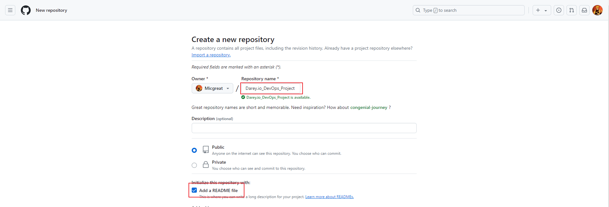

2. After which I cloned it to my local setup using git. Before cloning, I already created a directory on my local system `Documents/Workspace`, to have all my work done there. 

3. For proper documentation purposes, I created another directory  and named it `capstone_projects/greenwood-library-website` to have all the projects properly labelled. 

## Step 2: Creating the Files for the Website

### Tasks:

1. Using nano, I created 4 webpages (home.html,about_us.html, events.html and contact_us.html) and added random contents to give it flesh. 

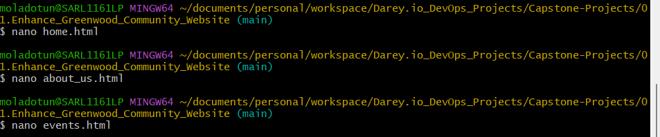

2. The project was originally set up in the main branch. On completion of setting up the files, I 
Staged, 
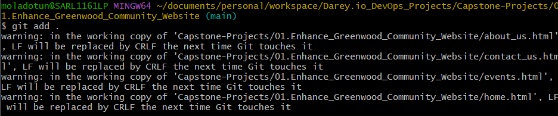
Committed
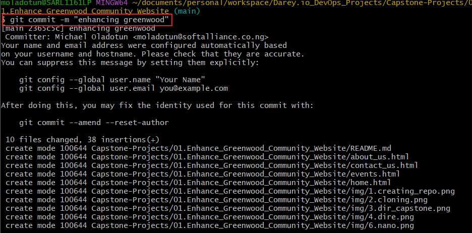 and 
Pushed directly to the main branch. 
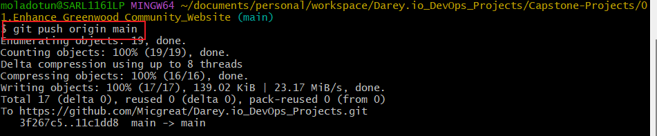

3. A new developer `Morgan` is to collaborate on the work being done and I had to create a new branch for Morgan 

4. Morgan got to work and added a new section for book reviews to the project

 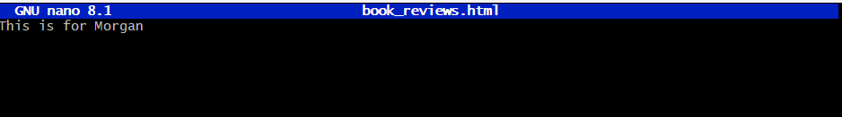

5. When Morgan was done with the section, it was staged, committed and pushed to the repository. (Similar process as above)

6. A pull request was raised to ask for a review then to be merged with the repository.

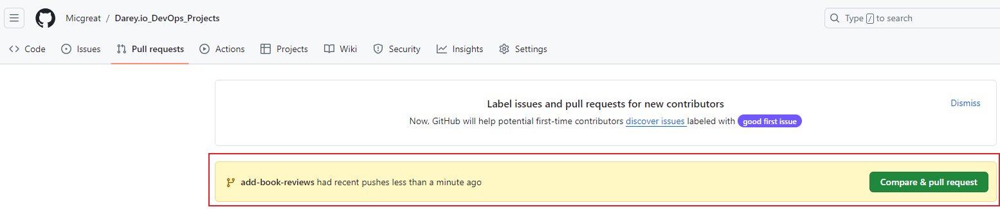
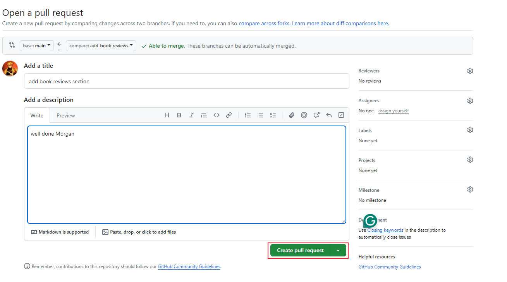
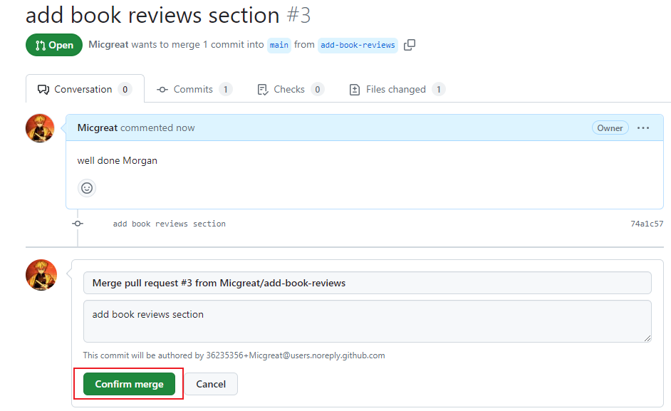

7. Tasks 3-6 was repeated for a new developer `Jamie`

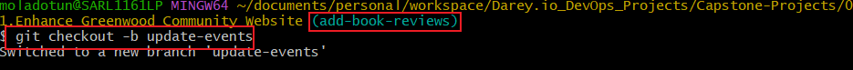
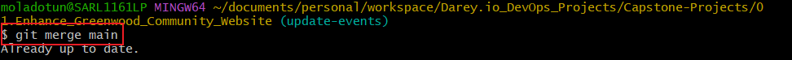
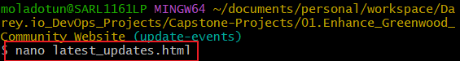
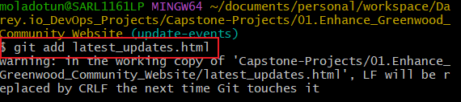

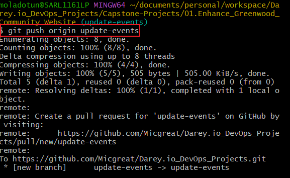

test 
