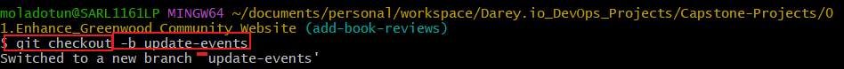

3. A new developer Morgan is to collaborate on the work being done and I had to create a new branch for Morgan 

4. Morgan got to work and added a new section for book reviews to the project

 

5. When Morgan was done with the section, it was staged, committed and pushed to the repository. (Similar process as above)

6. A pull request was raised to ask for a review then to be merged with the repository.

7. Tasks 3-6 was repeated for a new developer `Jamie`

test 
