# Capstone Project #2: E-Commerce Platform Deployement with Git, Linux, and AWS 

## Project Scenario 

I was assigned to develop an e-commerce webstite for a new online marketplace named `MarketPeak.` The platform will feature product listings, a shopping cart, and user authentication. I am expected to utilize Git for version control, develop the platform in a Linux environment, and deploy it on an AWS EC2 instance. 

## Objectives 
1. Repository implementation 
2. Working with Git: branch, staging, commit, and pushing. 
3. Website implementation from templates in a Linux environment and deploying on AWS EC2.

## Step 1: Setting up the Repository.

### Tasks: 
1. Still working with my centralized repository `Darey.io_DevOps_Project`, I made a new diretory and named it `02.MarketPeak_Ecommerce` to follow my naming convention.

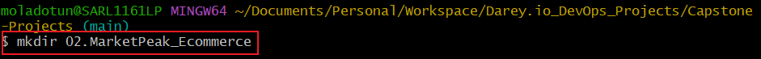

2. I changed directory `cd` to initialize the git repository and manage the version control.

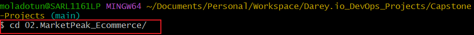

3. Git repository is initialized 

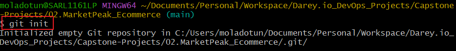

4. An image folder `img` is essential to have all the images used in a centralized location.

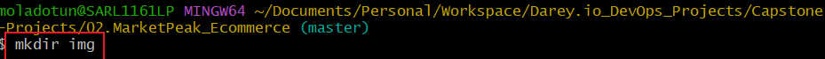

5. Lastly the `README.md` file is added for proper documentation. 


## Step 2: Preparing the Website Template to be Used.

### Tasks:
1. I downloaded the template and extracted it to the project directory on my local repository. 

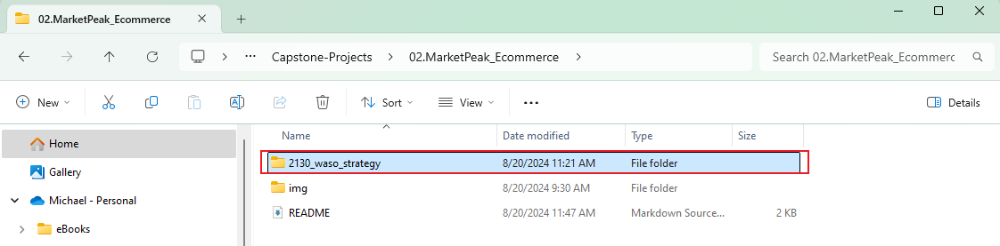

2. Staged all the updates made 


3. I went ahead to set up git global configuration with my username 

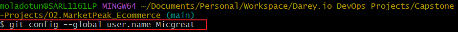

        and email.


4. Commit the updates 

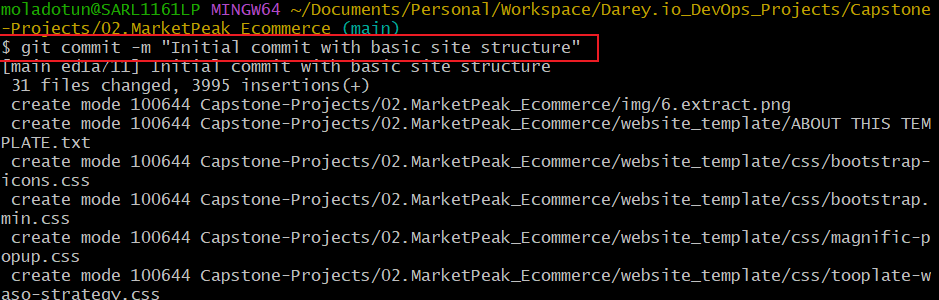

## Step 3: Set up an AWS EC2 Instance 

### Tasks:
1. Accessed the AWS website to launch an EC2 instance 

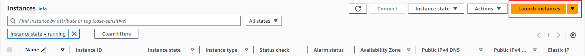

2. Named the instance `MarketPeak_Ecommerce`, selected `Amazon Linux AMI` and launched.

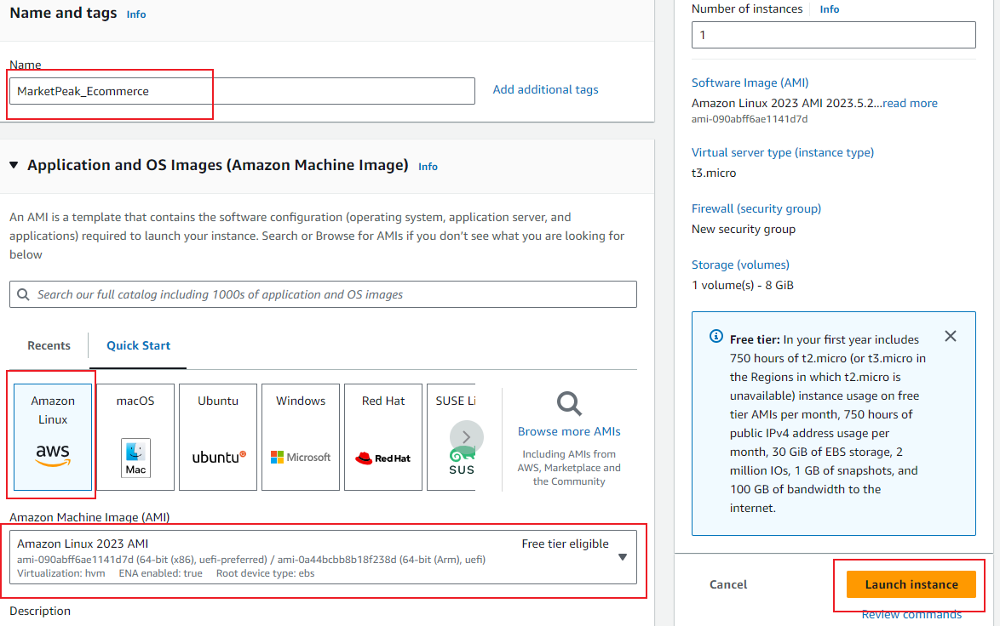
 Launched successfully 


## Step 4: Connect to the Instance on Linux Server and Clone the Repository

### Tasks:
1. I connected to the AWS AMI instance by copying the connect code from the aws management portal.

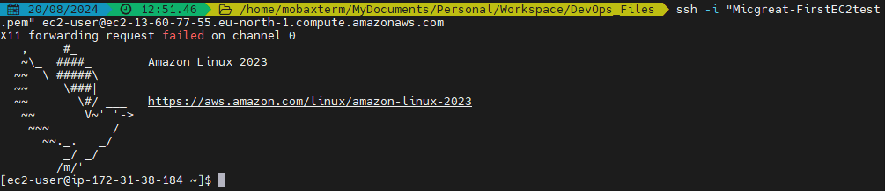

2. I generated a public ssh `id_rsa.pub` public key to connect with github

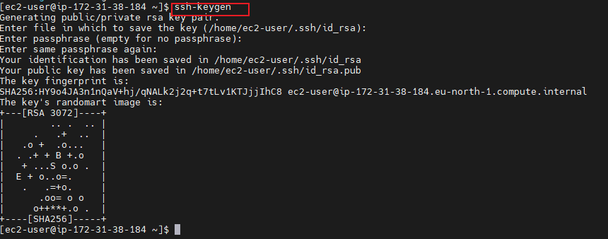

3. located the directory where the key is located to copy out and paste in github

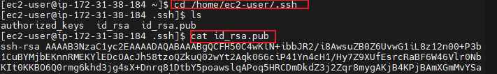

b. ssh pasted in github under settings

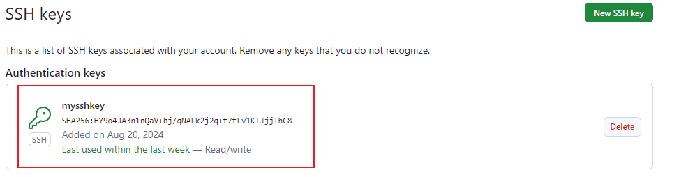

4. To successfully clone the repository from github to the server, I installed git `sudo yum install git`

```markdown
$sudo yum install git
```

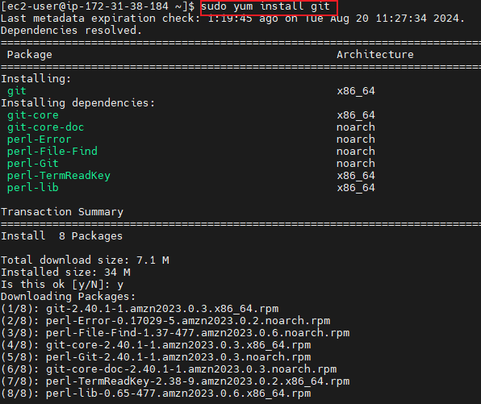

5. All that's left is to copy the `HTTPS` clone link from github repository and paste to the server.


## Step 5: Install a Webserver on EC2 

### Tasks:
1. I installed an Apache webserver on the EC2 instance

```markdown
$sudo yum update -y
```


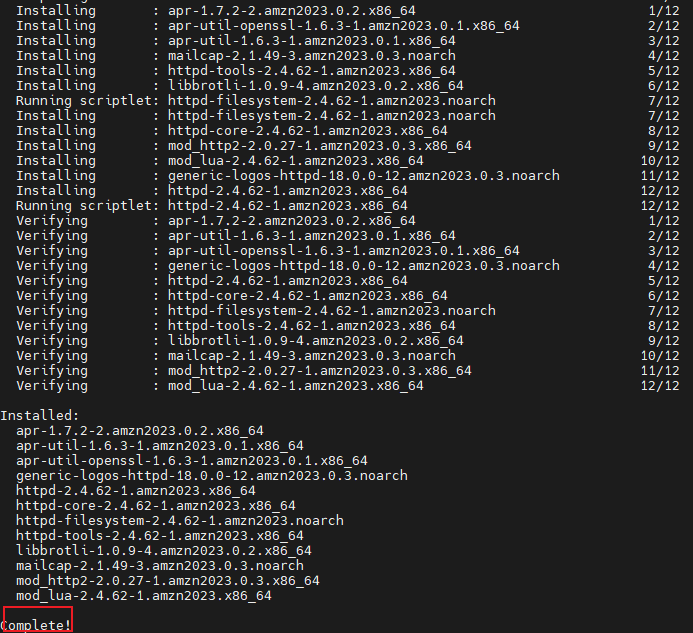

2. Start and enable the apache server 

```markdown
$sudo systemctl start httpd
$sudo systemctl enable httpd
```


3. I then configured the server for the website so as to point to the directory on the linux server. First I removed the default web direcory and copied the MarketPeak_Ecommerce to it

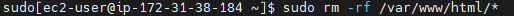

b. copied new directory to it

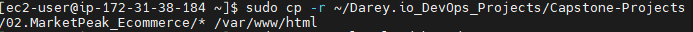 

4. Reload the changes by reloading the httpd service

```markdown
$sudo systemctl reload httpd
```

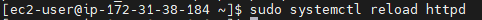

5. After all, I was able to see the website 


## Step 6: Continuous Integration and Development Workflow 

### Tasks:
1. I set up a `development branch` to ensure a smooth workflow for developing, testing and deploying. This isolates new features and bug fixes from the stable version of the website 

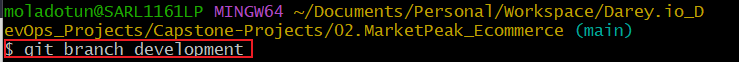

2. I switched over to the newly created development to create a file to be pushed to the production server.


3. Created the file `update.html` and echoed `freestyle` into it to be pushed.

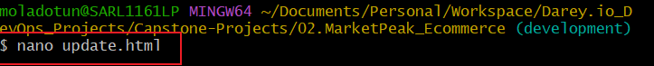

4. Staged, committed and pushed to the remote repository to be pulled by the production server. 

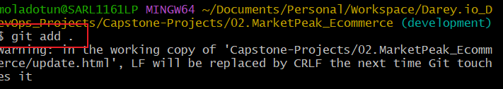

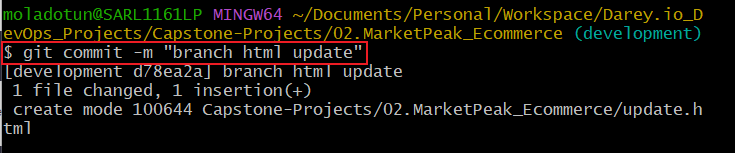

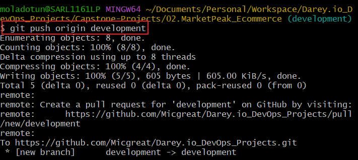

5. The update.html was copied to var/www/html and became the new page but wasn't saved because the content was only `freestyle`


## Challenges and Troubleshooting
1. I generated the ssh keygen from the production server, copied it to paste in github repssh and CPG Key, but I copied the private key instead of the public key 

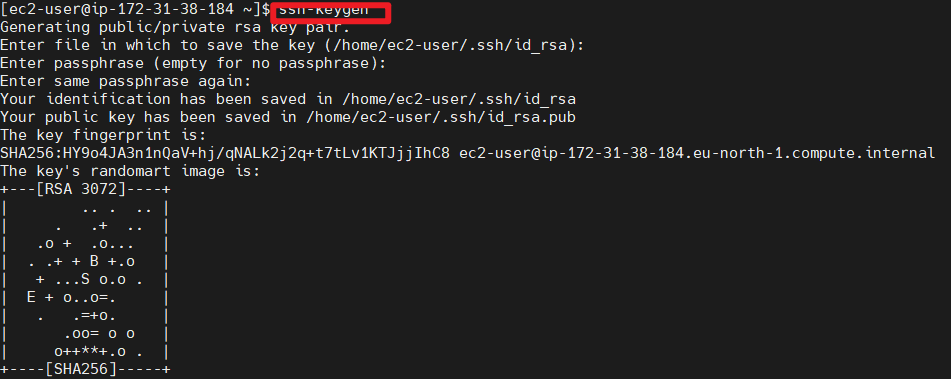

I catted this below, mistaken it for the public key 

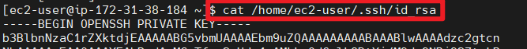

Should have catted this instead 

```markdown
$ cat /home/ec2-user/.ssh/id_rsa.pub
```


2. Had issues cloning the git hub repository to the `apache server` (prod server)

... it's not possible to clone the sub-directory byt copying the url link, the only way is to life the entire repository, regardless of the number of folders present.


3. It's not possible to copy a folder to another location while in the directory. The directory to the cloned file would have to be copied to `/var/www/html` but the initial file in there would be deleted first before copying. `ref step 5 task 3`

4. I had a challenge pushing an update, as I was pushing from the branch and didn't merge the branch to the main. `All updates should be pushed from the main branch.

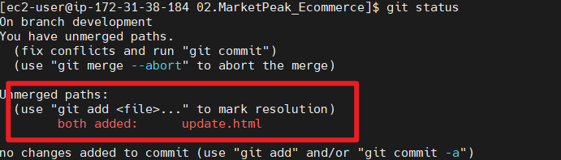

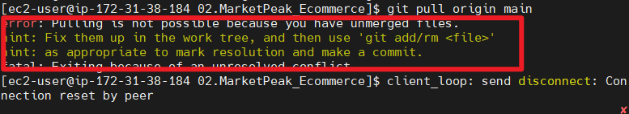

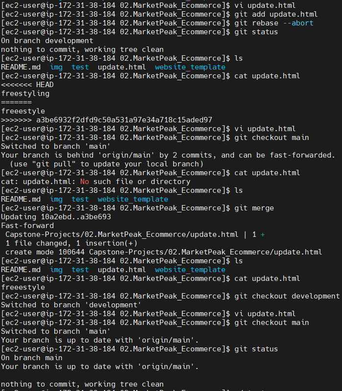