# Capstone Project #3: Bash Script for Generating a Multiplication Table 

## Project Scenario

Using bash script, I created a script that generates a multiplication table for a number entered by the user. It prompts the user to enter a number and then ask if they prefer to see a full multiplication table from 1 to 10 or a partial table with specified range. 

## Objectives
1. Familiarize with windows Ubuntu as bash is a linux/unix language
2. Implement using loops, user inputs and conditional logic.
3. Use of comment for code quality and readability.

## Step 1: Implement the Functions

1. A Bash script typically starts with a shebang (#!) followed by the path to the Bash interpreter (/bin/bash).

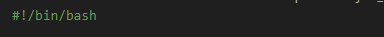

2. Initialize the functions for both ascending and descending display.

    Ascending = `display_table_ascending`

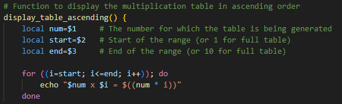

Descending = `display_table_ascending`
   
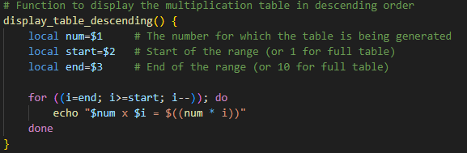

3. Verify if the input `is_number` is a valid number, if not print invalid.

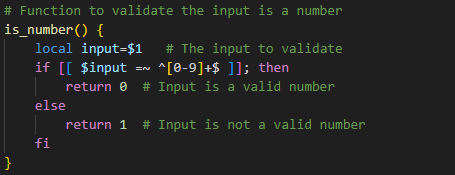

## Step 2: Input Request
1. Display the instruction for the user to input a number and store in `number` variable.

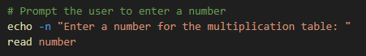

2. Validate the input is a number
 
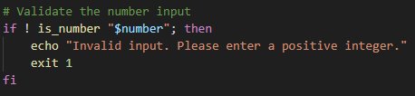

3. Print out a request for either partial or full table

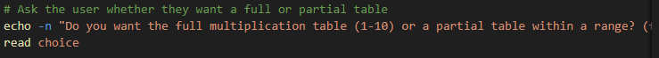

4. Range initialization

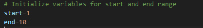

5. Range request for start and end values if the user selects partial

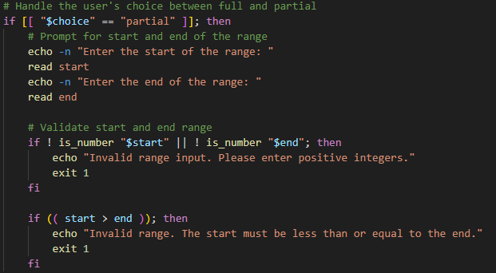

6. If user selects full table

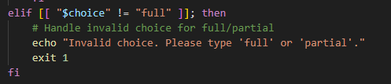

## Step 3: Order Request

1. Request for which order the display should be in

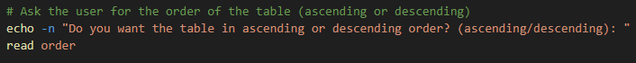

2. Display result 

## Results

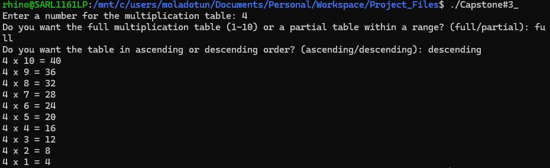

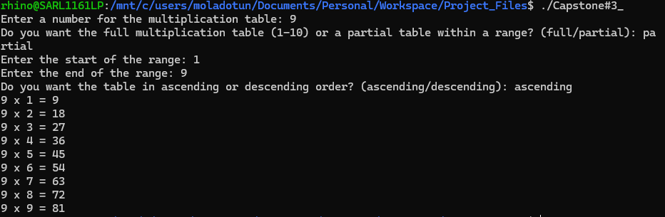

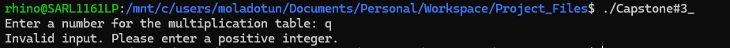