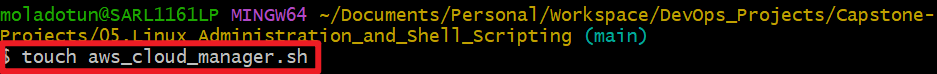
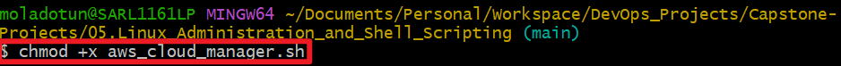
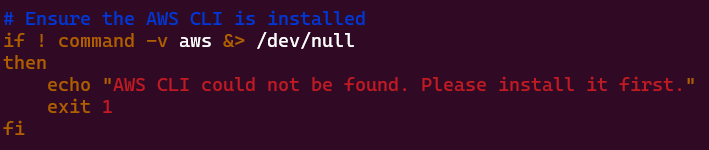
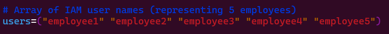
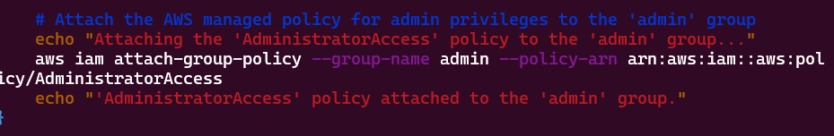
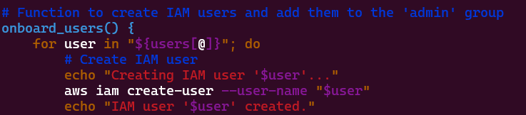
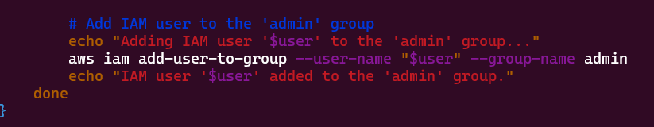
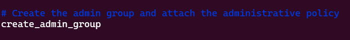
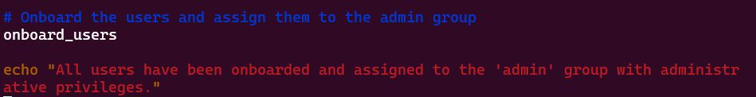

# Capstone Project #5: Shell Script for AWS IAM Management

## Project Scenario
Datawise Solutions requires an efficient management of their AWS IAM. I am tasked to write a shell script for its team that needs to onboard five new employees to access AWS resources securely. 

## Objectives
1. Script enhancement
2. Define IAM user names array
3. Create IAM users.
4. Create IAM group.
5. Attach administrative policy to group.
6. Assign users to group.

## Tasks

1. Created the file `aws_cloud_manager.sh`

2. Gave the file execute permission

3. Ensure they have AWS CLI imstalled 

4. Create an array for the employees to be onboarded

5. Create admin group 

6. Attach the admin group to the admin policy 

7. Create the users to be onboarded

8. Add all the created users to the admin group

9. Attache the admnin policy to the admin group created

10. Onboard the users

