# Capstone Projet #6: Frontend Application with Docker and Kubernetes

## Project Scenario

I developed a simple static website (HTML and CSS) for a company's landing page. The goal is to containerize this application using Docker, deploy it to a kubernetes cluster, and access it through nginx. 

## Objectives
1. Implement with git
2. Dockerize the application 
3. Make use of Docker hub
4. Use Kubernetes Cluster

## Step 1: Setup and Git Initialization 
### Tasks:

1. Create a new project directory.
```markdown
mkdir 06.Frontend_Application_with_Docker_and_Kubernetes
```
2. Create a new html file
```markdown
touch index.html
```
3. vim index.html and add the code
```markdown
vim index.html
```
Paste the code below
```markdown
<!DOCTYPE html>
<html lang="en">
<head>
    <meta charset="UTF-8">
    <meta name="viewport" content="width=device-width, initial-scale=1.0">
    <title>Simple Static Web App</title>
    <style>
        body {
            font-family: Arial, sans-serif;
            background-color: #f4f4f4;
            color: #333;
            margin: 0;
            padding: 20px;
            text-align: center;
        }
        header {
            background-color: #4CAF50;
            color: white;
            padding: 10px 0;
            font-size: 24px;
        }
        .content {
            margin-top: 20px;
        }
        button {
            background-color: #4CAF50;
            color: white;
            border: none;
            padding: 10px 20px;
            font-size: 16px;
            cursor: pointer;
        }
        button:hover {
            background-color: #45a049;
        }
        footer {
            margin-top: 30px;
            color: #777;
        }
    </style>
</head>
<body>

    <header>
        Welcome to My Simple Web App
    </header>

    <div class="content">
        <p>This is a static web application created using HTML and CSS. It contains basic elements like text, buttons, and styles.</p>
        <button onclick="alert('Button Clicked!')">Click Me!</button>
    </div>

    <footer>
        <p>&copy; 2024 My Web App. All rights reserved.</p>
    </footer>

</body>
</html>

```
4. Create a new .css file
```markdown
touch styles.css
```
5. Vim styles.css and add the code

```markdown
vim styles.css
```
Paste the code below

```markdown
/* General body styling */
body {
    font-family: 'Arial', sans-serif;
    margin: 0;
    padding: 0;
    background-color: #f7f7f7;
    color: #333;
    line-height: 1.6;
}

/* Header styling */
header {
    background-color: #4CAF50;
    color: white;
    padding: 20px 0;
    text-align: center;
    font-size: 24px;
    font-weight: bold;
}

/* Main content area */
.container {
    width: 80%;
    margin: 0 auto;
    padding: 20px;
    text-align: center;
}

/* Button styling */
button {
    background-color: #4CAF50;
    color: white;
    border: none;
    padding: 10px 20px;
    margin-top: 20px;
    cursor: pointer;
    font-size: 16px;
    transition: background-color 0.3s ease;
}

button:hover {
    background-color: #45a049;
}

/* Links styling */
a {
    color: #4CAF50;
    text-decoration: none;
    font-weight: bold;
}

a:hover {
    color: #388E3C;
    text-decoration: underline;
}

/* Footer styling */
footer {
    background-color: #333;
    color: white;
    padding: 10px 0;
    text-align: center;
    position: relative;
    bottom: 0;
    width: 100%;
    font-size: 14px;
}

/* Responsive media query */
@media (max-width: 600px) {
    .container {
        width: 100%;
        padding: 10px;
    }

    header {
        font-size: 20px;
    }

    button {
        padding: 8px 16px;
        font-size: 14px;
    }
}

```
6. Add, Commit and Push to Git

Add
```markdown
Git add .
```
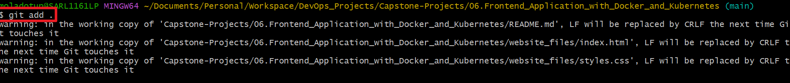

Commit
```markdown
Git commit -m "Updated README.md"
```
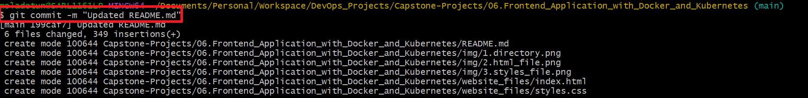

Push 
```markdown
Git Push
```
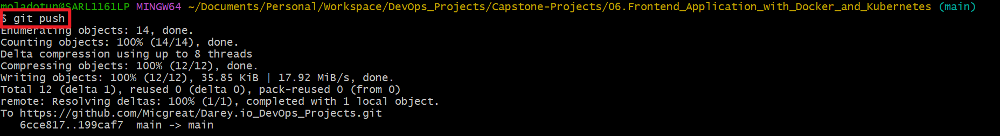

## Step 2: Dockerize the Application

### Tasks:

1. Create a `dockerfile` and specify nginx as the base image in the same directory as the index.html file.

```markdown
touch dockerfile
```
```markdown
vim dockerfile
```

Paste the code below

```markdown
# Use the official NGINX base image
FROM nginx:latest

# Set the working directory in the container
WORKDIR  /usr/share/nginx/html/

# Copy the local HTML file to the NGINX default public directory
COPY index.html /usr/share/nginx/html/

# Expose port 80 to allow external access
EXPOSE 80

# No need for CMD as NGINX image comes with a default CMD to start the server
```

2. Build an image using the `dockerfile` just created.

```markdown
docker build -t dockerfile .
```
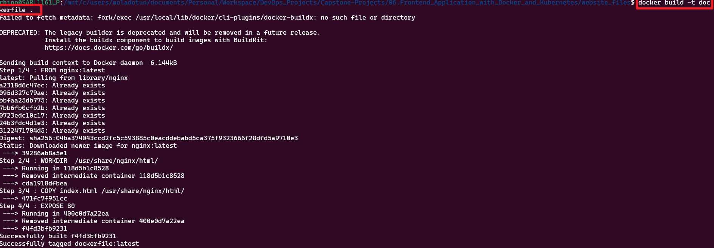

3. Check the images list to confirm the dockerfile image is already created

```markdown
docker images 
```
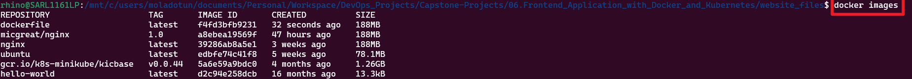

4. Run a container based on the image created and map it to a listening port

```markdown
docker run -p 8080:80 dockerfile
```
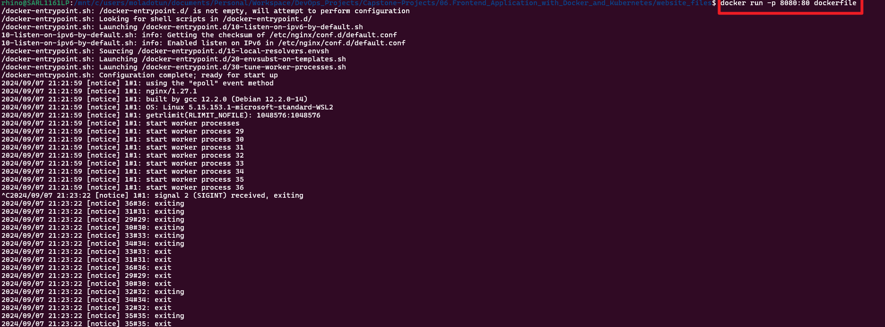

5. Check the list of available containers

```markdown
docker ps -a
```

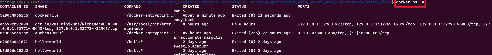

6. Copy out the container ID and start

```markdown
docker start 5a04c49663c5 
```

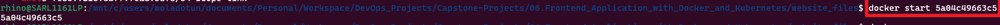

7. Type the docker host IP in the host web browser including the port to view the webpage.

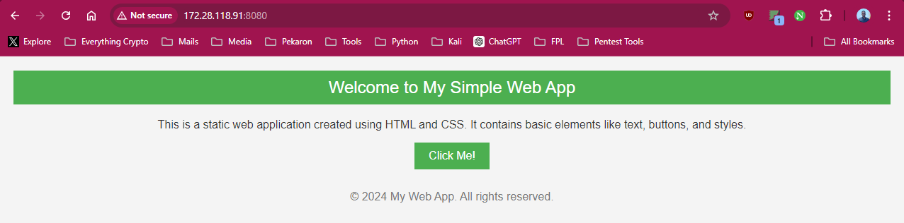


## Step 3: Push to Dockerhub

### Tasks:

1. I already have a dockerhub account, I'll tag my image using my username and repository name then push.

```markdown
docker tag dockerfile micgreat/capstone6:1.0
```
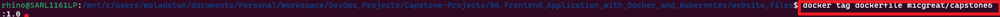

2. Login to docker hub 

```markdown
docker login -u micgreat
```


3. Push the image to docker hub

```markdown
docker push micgreat/capstone6:1.0
```
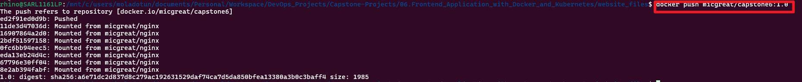


## Step 4: Set up a Kind Kubernetes Cluster

### Tasks:

1. Install Kind (Kubernetes in Docker)
```markdown
curl -Lo ./kind https://kind.sigs.k8s.io/dl/v0.20.0/kind-linux-amd64
chmod +x ./kind
sudo mv ./kind /usr/local/bin/kind
```
2. Create a Kind Cluster

```markdown
kind create cluster --name cap6
```


## Step 5: Deploy to Kubernetes

### Tasks:

1. Create a Kubernetes YAML file

```markdown
touch cap6.yaml
```

```markdown
vim cap6.yaml
```

Paste the code

```markdown
apiVersion: apps/v1
kind: Deployment
metadata:
  name: cap6-deployment  # Name of the deployment
spec:
  replicas: 1  # Number of replicas (pods) you want to run
  selector:
    matchLabels:
      app: cap6-web  # The label selector to identify the pods managed by this deployment
  template:
    metadata:
      labels:
        app: cap6-web  # Label to identify the pods created by this deployment
    spec:
      containers:
      - name: cap6-container  # Name of the container
        image: micgreat/capstone6:1.0  # Docker image for the container
        ports:
        - containerPort: 80  # Port that the container will expose
```

2. Apply the deploymemt to the cluster

```markdown
kubectl apply -f cap6.yaml
```
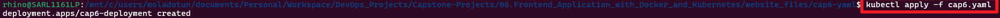

## Step 6: Create a Service (Cluster IP)

1. Create a Kubernetes Service YAML file 

```markdown
touch cap6_service.yaml
```

```markdown
vim cap6_service.yaml
```

Paste the code below

```markdown
apiVersion: v1
kind: Service
metadata:
  name: my-app-service  # Name of the service
spec:
  type: ClusterIP  # Service type (only accessible within the cluster)
  selector:
    app: my-app  # Selects the pods with this label (matches the deployment label)
  ports:
    - protocol: TCP
      port: 80  # Port on the service
      targetPort: 80  # Port on the pod that the service forwards traffic to
```

2. Apply the service to the cluster

```markdown
kubectl apply -f cap6_service.yaml
```


## Step 7: Access the Application

1. Port forward the service to access the application locally

```markdown
kubectl expose deployment.apps/cap6-deployment --type=NodePort --port=8080
```

2. Application can be viewed.