# Capstone Project #7: CI/CD Mastery

## Project Scenario
As a DevOps Engineer, I'm tasked to design and implement a robust CI/CD pipeline using Jenkins to automate the deployment of a web application. The goal is to achieve continuos integration and continuos deployment, and ensure the reliability of the applications.

## Objectives

1. Jenkins, Github, Pipelines and docker.

## Project Components:
## 1. Jenkins Server Setup

### Objective
Configure Jenkins server for CI/CD pipeline automation.

### Steps:
1. Install Jenkins on a dedicated server.

    ### Tasks:
    1. Set up AWS instance
    

    2. SSH connect to instance
    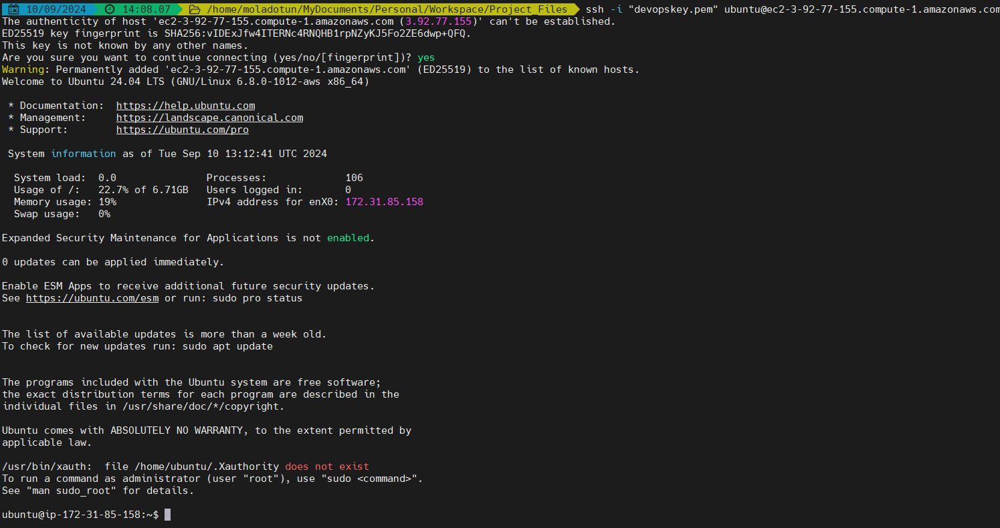

    3. Update 
    ```markdown
    sudo apt update
    ```

    4. Install JDK
    ```markdown
    sudo apt install default-jdk-headless
    ```

    5. Install Jenkins 
   ```markdown
    wget -q -O - https://pkg.jenkins.io/debian-stable/jenkins.io.key | sudo apt-key add -
    sudo sh -c 'echo deb https://pkg.jenkins.io/debian-stable binary/ > \
    /etc/apt/sources.list.d/jenkins.list'
    sudo apt update
    sudo apt-get install jenkins
   ```

   6. Jenkins running on port 8080
   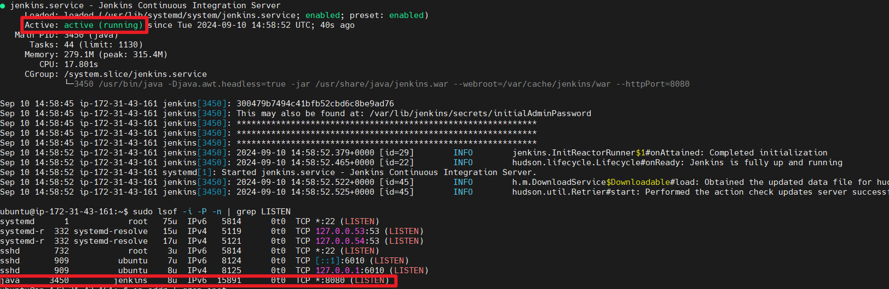
   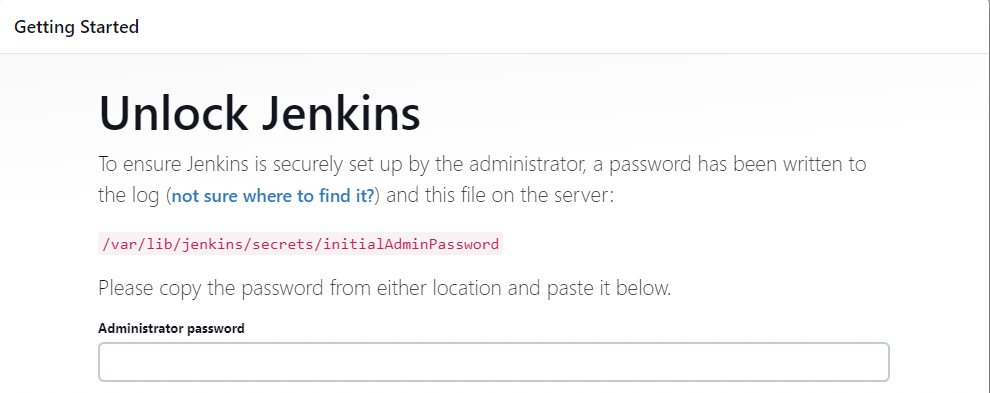

   7. Cat the password to login
   ```markdown
   sudo cat /var/lib/jenkins/secrets/initialAdminPassword
   ```
   
   8. Plugins Installed
   
   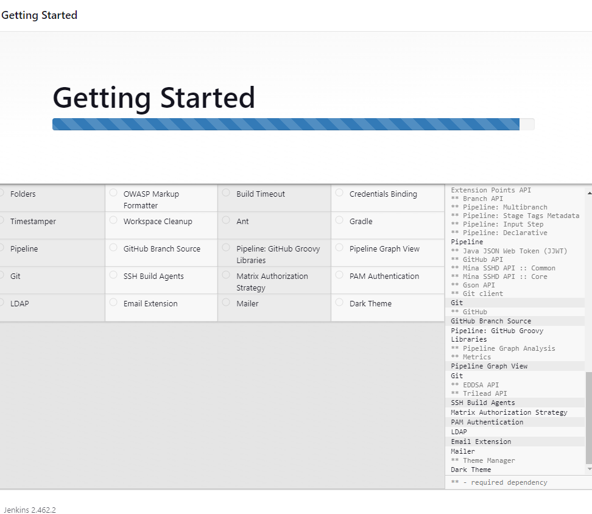

   9. Setting up the user 
   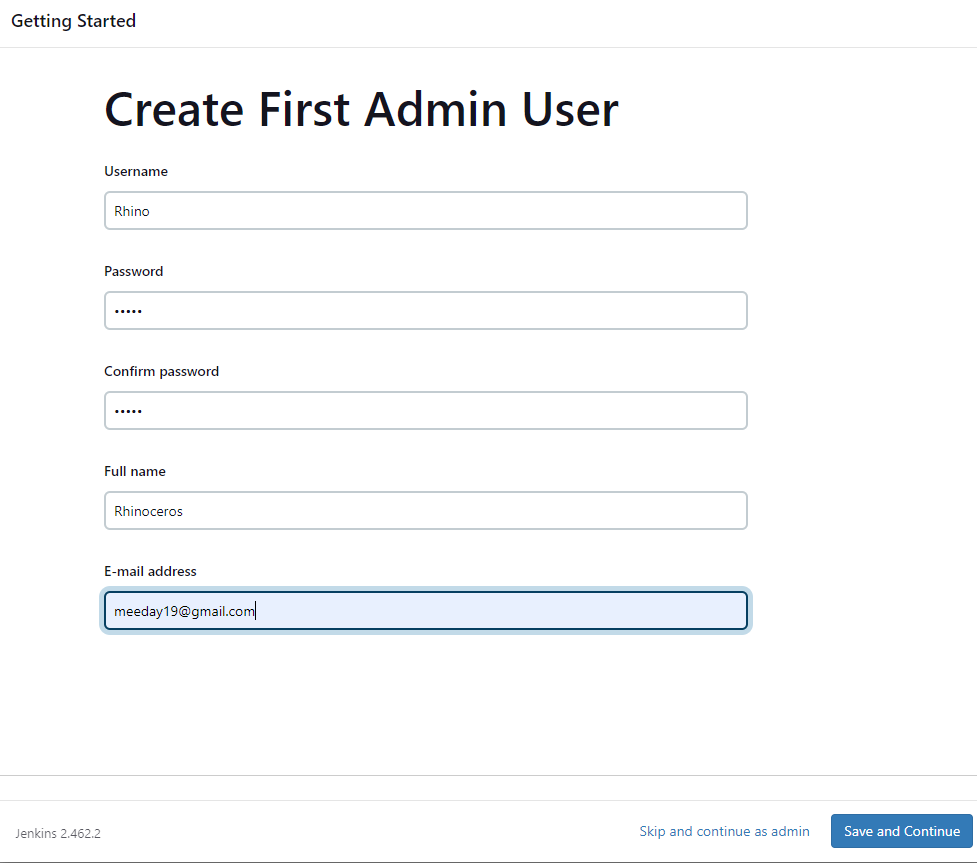

   Instance Config
   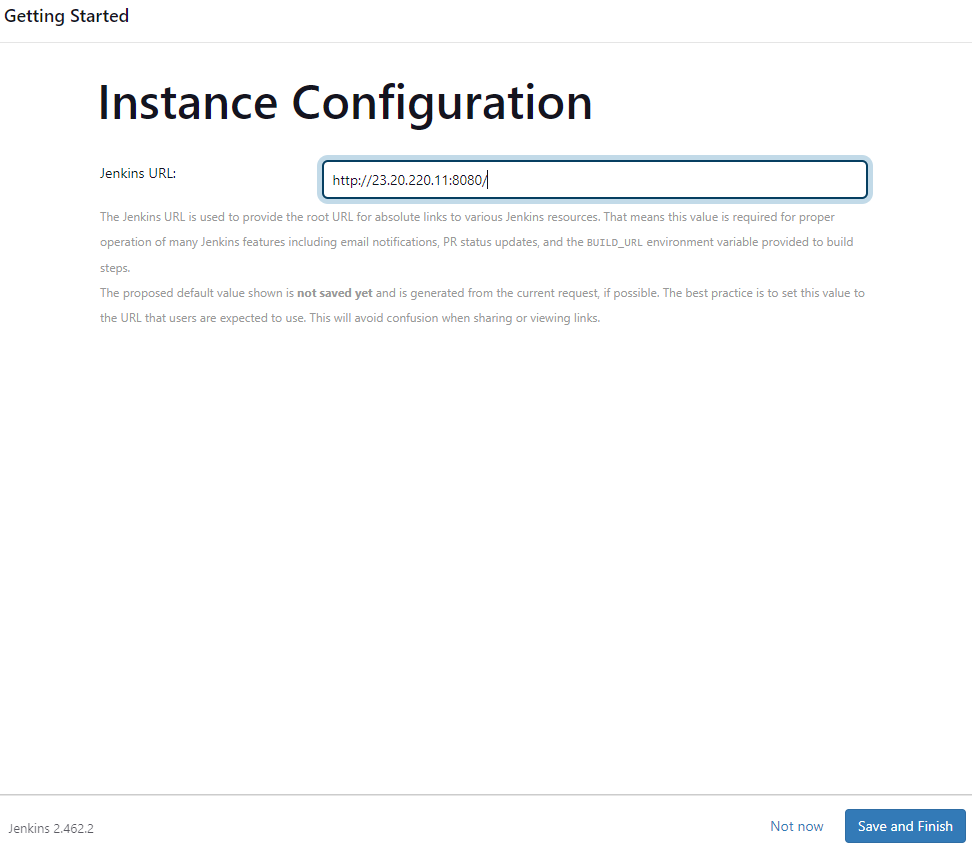

2. Create a Jenkins Freestyle and set up Source Code Management Repository Integration.

    ## Tasks:
    1. Integrate Jenkins with the source code (Github)

    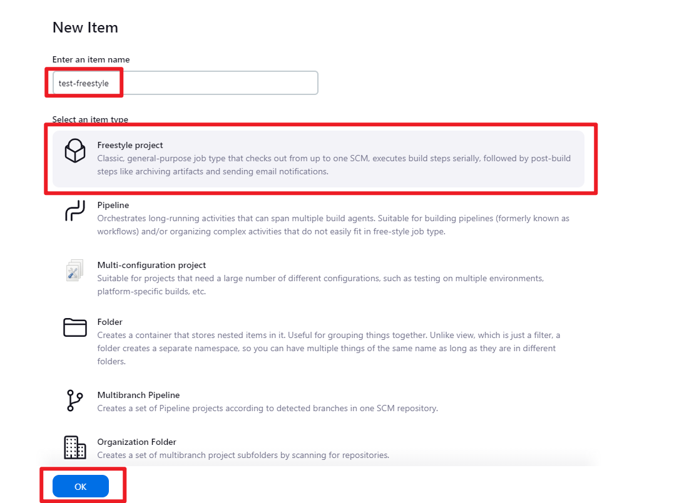

    Source Code Management
    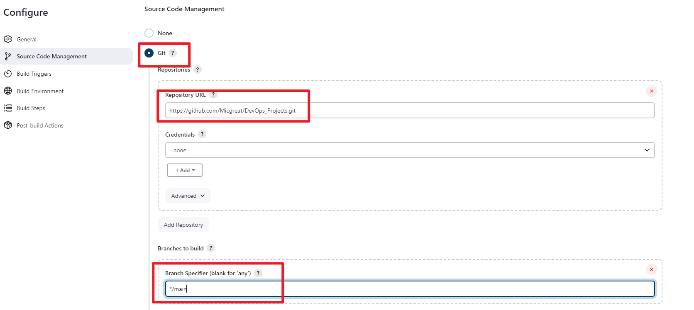

    Github hook trigger for GITScm polling
    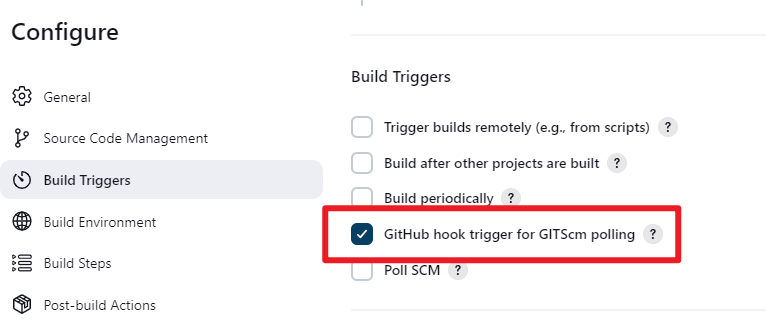

    2. Connecting github webhook
    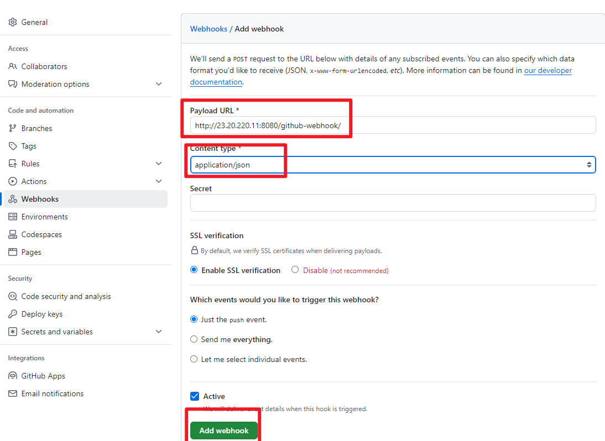

    3. Webhook won't be triggered unless I push a file from git to github, so I created a quick index file
    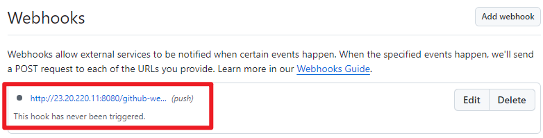

    ```markdown
    touch pipeline.html
    ```

    ```markdown
    echo "test for pipeline" > pipeline.html
    ```

    ```markdown
    git add .
    ```

    ```markdown
    git commit -m "Update for pipeline"

    ```
    ```markdown
    git push
    ``` 

    Trigger Successful after successful push

    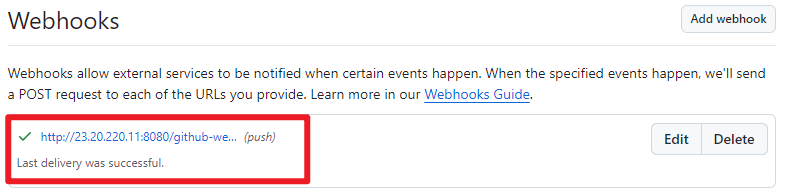

    Trigger confirmed successfully on github by the build

    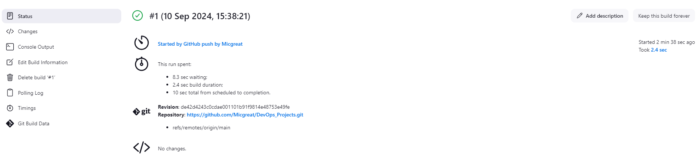

3.  Create a Jenkin Pipeline Script to run a Web Application
```markdown
pipeline {
    agent any

    environment {
        DOCKER_IMAGE = 'your-dockerhub-username/your-webapp-image'
        CONTAINER_NAME = 'webapp-container'
        APP_PORT = '8080' // Port on which the app runs inside the container
        HOST_PORT = '8080' // Port exposed to the host
        DOCKERHUB_CREDENTIALS = credentials('dockerhub-credentials') // Jenkins credentials ID for Docker Hub
    }

    stages {
        stage('Checkout') {
            steps {
                // Pull the application code from SCM (e.g., GitHub)
                checkout scm
            }
        }

        stage('Build Docker Image') {
            steps {
                script {
                    // Build the Docker image from the Dockerfile in the project
                    docker.build("${DOCKER_IMAGE}:latest")
                }
            }
        }

        stage('Push Docker Image') {
            steps {
                script {
                    // Login to Docker Hub and push the image
                    docker.withRegistry('', DOCKERHUB_CREDENTIALS) {
                        docker.image("${DOCKER_IMAGE}:latest").push()
                    }
                }
            }
        }

        stage('Run Web Application') {
            steps {
                script {
                    // Stop any running container with the same name
                    sh """
                    if [ \$(docker ps -q -f name=${CONTAINER_NAME}) ]; then
                        docker stop ${CONTAINER_NAME} && docker rm ${CONTAINER_NAME}
                    fi
                    """
                    // Run the web application in a Docker container
                    sh """
                    docker run -d --name ${CONTAINER_NAME} -p ${HOST_PORT}:${APP_PORT} ${DOCKER_IMAGE}:latest
                    """
                }
            }
        }
    }

    post {
        always {
            // Cleanup workspace
            cleanWs()
        }
    }
}
```


4. Docker Image Creation and Registry Push
    ### Tasks:
    1. Install docker on jenkins server
    ```markdown
    sudo apt update -y
    sudo apt install docker -y
    sudo service docker start
    sudo usermod -aG docker jenkins  # To allow Jenkins to run Docker commands without sudo
   ```

   2. Install `docker` and `docker pipeline` plugins on Jenkins and restart.

   

   3. Set up Jenkins credentials for docker hub

   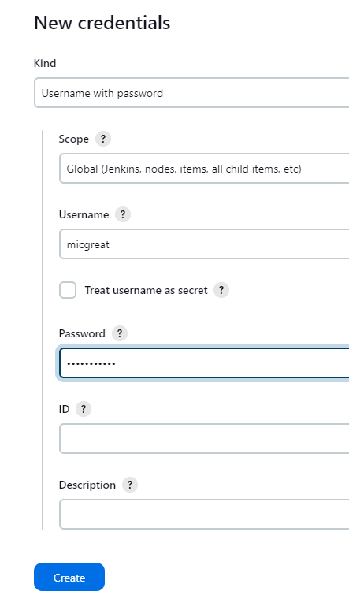

   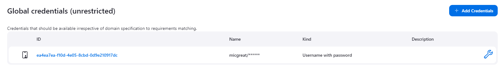

    4. Create a Jenkins pipeline script for docker build

   ```markdown
   pipeline {
    agent any

    environment {
        DOCKER_CREDENTIALS = credentials('docker-hub-credentials') // Docker Hub credentials ID
        IMAGE_NAME = "my-web-app" // Change this to your app's Docker image name
        DOCKER_REGISTRY = "my-dockerhub-username/${IMAGE_NAME}"
        CONTAINER_NAME = "web-app-container"
    }

    stages {
        stage('Clone Repository') {
            steps {
                // Clone the web application repository containing your Dockerfile
                git 'https://github.com/your-web-app-repo.git'
            }
        }

        stage('Build Docker Image') {
            steps {
                script {
                    // Build the Docker image using the Dockerfile in the repo
                    sh "docker build -t ${DOCKER_REGISTRY}:${BUILD_NUMBER} ."
                }
            }
        }

        stage('Push to Docker Hub') {
            steps {
                script {
                    // Login to Docker Hub and push the image
                    sh "docker login -u ${DOCKER_CREDENTIALS_USR} -p ${DOCKER_CREDENTIALS_PSW}"
                    sh "docker push ${DOCKER_REGISTRY}:${BUILD_NUMBER}"
                }
            }
        }

        stage('Run Docker Container') {
            steps {
                script {
                    // Stop and remove the old container if it's running
                    sh """
                    if [ \$(docker ps -a -q -f name=${CONTAINER_NAME}) ]; then
                        docker stop ${CONTAINER_NAME}
                        docker rm ${CONTAINER_NAME}
                    fi
                    """

                    // Run a new container using the built image
                    sh "docker run -d --name ${CONTAINER_NAME} -p 8080:80 ${DOCKER_REGISTRY}:${BUILD_NUMBER}"
                }
            }
        }

        stage('Clean Up') {
            steps {
                script {
                    // Remove the Docker image locally after running the container to save space
                    sh "docker rmi ${DOCKER_REGISTRY}:${BUILD_NUMBER}"
                }
            }
        }
    }
    ```


5. Test the pipeline and acces the web application.

    ```markdown
    http://<your-server-ip>:8080
    ```
    