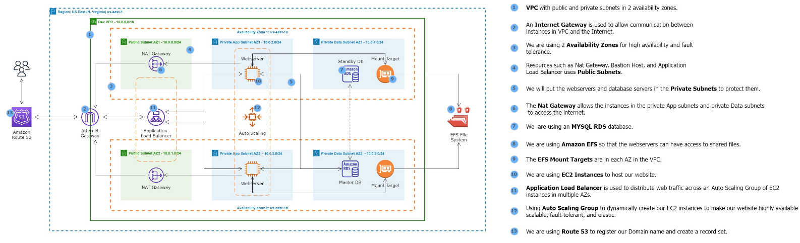
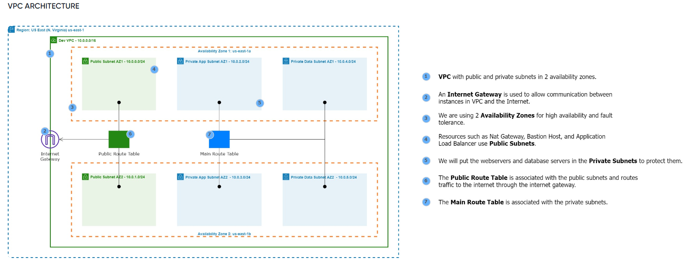
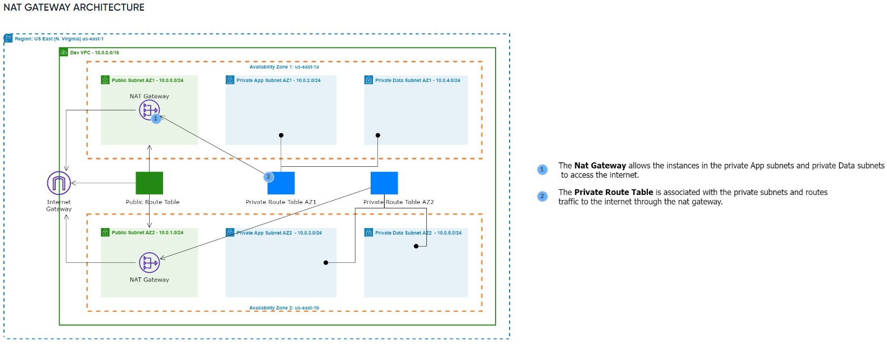
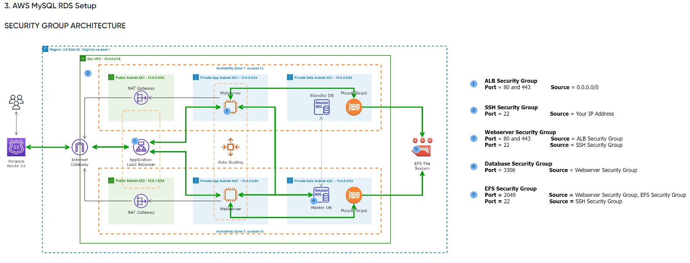

# Capstone Project #9: Terraform Automated Wordpress Deployment on AWS

In this project, I'm creating an high-performance, scalable, secure and cost-effective wordpress website for my client `DigitalBoost` using various AWS services and automating it through terraform. Terraform is the key to achieve a streamlined and reproducible deployment process. 



## Task 1: VPC Setup

The aim is to create a VPC to isolate and secure the wordpress infrastructure. 

I used terraform to define the VPC, availability zones, internet gateways, subnets and route tables, leveraging variables for customization and document the commands for execution. I employed the modular structure for the setup, declaring every resource in it's own module for easy read and configuration. Example:

```markdown
root-directory/
  ├── main.tf                  # Root configuration file
  ├── modules/
  │   └── ec2/
  │       └── main.tf          # EC2 module with bastion host

```



Define the AWS provider. NB, the access and secret key were preconfigured using aws cli earlier.

### `Modules: VPC`

`main.tf`

```markdown
# create VPC
resource "aws_vpc" "main" {
    cidr_block  = var.cidr
    tags        = {
    Name        = "main-vpc"
  }
}
```

`output.tf`
```markdown
# This will show the output of the VPC created
output "vpc_id" {
    description = "The ID of the VPC"
    value = aws_vpc.main.id

}
```
`variable.tf`

```markdown
# VPC variable
variable "cidr" {
    description = "VPC CIDR block"
    type = string
    default = "10.0.0.0/16"
    sensitive = true
}
```


### `Modules: Internet Gateway (igw)`
`main.tf`
```markdown
# Create Internet Gateway
resource "aws_internet_gateway" "igw" {
  vpc_id = var.vpc_id

  tags = {
    Name = "main-igw"
  }
}

```
`output.tf`
```markdown
output "aws_internet_gateway" {
  description = "The Internet Gateway"
  value       = aws_internet_gateway.igw.id
}

```
`variables.tf`
```markdown
variable "vpc_id" {
    description = "created aws vpc"
    type = string 
}
```

### `Modules: Subnets`
`main.tf`

```markdown
# Create the public subnets for AZ1
resource "aws_subnet" "az1_public_subnets" {
    vpc_id              = var.vpc_id
    cidr_block          = var.public_subnets[0]
    availability_zone   = var.az[0]  

  tags = {
    Name = "public_subnet_${0}"
  }
}

# Create the public subnets for AZ2
resource "aws_subnet" "az2_public_subnets" {
    vpc_id              = var.vpc_id
    cidr_block          = var.public_subnets[1]
    availability_zone   = var.az[1]  

  tags = {
    Name = "public_subnet_${1}"
  }
}

# Create the private az1 (app & data) subnets 
resource "aws_subnet" "private_az1_group_subnets" {
    count               = length(var.private_az1_subnets)
    vpc_id              = var.vpc_id
    cidr_block          = var.private_az1_subnets[count.index]
    availability_zone   = var.az[0]

    tags = {
      Name = "private_app_subnet_${count.index}"
    }  
}

# Create the private az2 (app & data) subnets  
resource "aws_subnet" "private_az2_group_subnets" {
    count               = length(var.private_az2_subnets)
    vpc_id              = var.vpc_id
    cidr_block          = var.private_az2_subnets[count.index]
    availability_zone   = var.az[1]

    tags = {
      Name = "private_subnet_${count.index}"
    }
  
}
```
`output.tf`
```markdown
# output of az1 public subnets ids
output "az1_public_subnets_ids" {
    description = "The ID's of az1 public subnets created"
    value       = aws_subnet.az1_public_subnets.id
}

# output of az2 public subnets ids
output "az2_public_subnets_ids" {
    description = "The ID's of az2 public subnets created"
    value       = aws_subnet.az2_public_subnets.id
}

# output of private az1 subnets ids
output "private_az1_subnets_ids" {
    description = "The ID's of private az1 subnets created"
    value = aws_subnet.private_az1_group_subnets[*].id  
}

# output of private az2 subnets ids
output "private_az2_subnets_ids" {
    description = "The ID's of private az2 subnets created"
    value = aws_subnet.private_az2_group_subnets[*].id  
}
```
`variables.tf`
```markdown
# VPC variable
variable "vpc_id" {
    description = "created aws vpc"
    type = string 
}
# Availablilty Zones Variable
variable "az" {
    description = "Availabiilty zones list"
    type = list(string)
    default = [ "us-east-1a", "us-east-1b" ]
    sensitive = true 
}

# Public Subnets Variable
variable "public_subnets" {
    description = "List of public subnets cidr"
    type = list(string)
    default = [ "10.0.0.0/24", "10.0.1.0/24" ]
}

# Private AZ1 Subnets Variable
variable "private_az1_subnets" {
    description = "List of private-az1 subnets cidr"
    type = list(string)
    default = [ "10.0.2.0/24", "10.0.4.0/24" ]  
}

# Private AZ2 Subnets Variable
variable "private_az2_subnets" {
    description = "List of private-az2 subnets cidr"
    type = list(string)
    default = [ "10.0.3.0/24", "10.0.5.0/24" ]  
}
```


## Task 2: NAT Gateway in Public Subnets to Route Private Subnet to Internet

The aim is to implement a secure network architecture with public and private subnets. Using NAT gateway for private subnet internet access.

I used terraform to define the subnets, security groups and NAT Gateway, ensuring proper association of resources with corresponding subnets. 



1. The NAT gateway needs an elastic IP and route table to properly connect the private subnets to the internet

### `Modules: Elastic Ip`
`main.tf`
```markdown
# Create Elastic IP for the NAT gateway AZ1

resource "aws_eip" "for_az1_NAT" {
}

# Create Elastic IP for the NAT gateway AZ2

resource "aws_eip" "for_az2_NAT" {
}

```
`output.tf`
```markdown
# output az1 eips
output "az1_eip" {
    value = aws_eip.for_az1_NAT.id
}

# output az2 eips
output "az2_eip" {
    value = aws_eip.for_az2_NAT.id
}
```

### `Modules: Route tables`
`main.tf`

```markdown
# Create the public route table for the public subnets
resource "aws_route_table" "public_route_table" {
  vpc_id = var.vpc_id

  route {
    cidr_block  = "0.0.0.0/0"
    gateway_id  = var.aws_internet_gateway
  }
}

# associate with the az1 public route table with the subnets
resource "aws_route_table_association" "az1_public_route_table_assoc" {
  subnet_id      = var.az1_public_subnets_ids  
  route_table_id = aws_route_table.public_route_table.id  
}

# associate with the az2 public route table with the subnets
resource "aws_route_table_association" "az2_public_route_table_assoc" {
  subnet_id      = var.az2_public_subnets_ids
  route_table_id = aws_route_table.public_route_table.id  
}

# Create the private-az1 route table for the private subnets
resource "aws_route_table" "private_az1_route_table" {
  vpc_id = var.vpc_id

  route {
    cidr_block = "0.0.0.0/0"
    nat_gateway_id = var.az1_NAT_public_access
  }
}

# associate the az1 private route table with the subnets
resource "aws_route_table_association" "az1_private_route_table_assoc" {
  count          = length(var.private_az1_subnets_ids)  
  subnet_id      = var.private_az1_subnets_ids[count.index]  
  route_table_id = aws_route_table.private_az1_route_table.id  
}

# Create the private-az2 route table for the private subnets
resource "aws_route_table" "private_az2_route_table" {
  vpc_id = var.vpc_id

  route {
    cidr_block = "0.0.0.0/0"
    nat_gateway_id = var.az2_NAT_public_access
  }
}

# associate the az1 private route table with the subnets
resource "aws_route_table_association" "az2_private_route_table_assoc" {
  count          = length(var.private_az2_subnets_ids)  
  subnet_id      = var.private_az2_subnets_ids[count.index]  
  route_table_id = aws_route_table.private_az2_route_table.id  
}
```
`variables.tf`

```markdown
#variable for vpc
variable "vpc_id" {
    description = "created aws vpc"
    type = string 
}

#variable for igw
variable "aws_internet_gateway" {
    description = "Internet gateway"
    type = string
}

#variable for az1 NAT
variable "az1_NAT_public_access" {
    description = "NAT gateway"
    type = string
}

#variable for az2 NAT
variable "az2_NAT_public_access" {
    description = "NAT gateway"
    type = string
}

#variable for az1 public subnet
variable "az1_public_subnets_ids" {
    description = "az1 public subnet ID's"
    type = string
}

#variable for az2 public subnet
variable "az2_public_subnets_ids" {
    description = "az2 public subnet ID's"
    type = string
}

# variable for az1 private subnets
variable "private_az1_subnets_ids" {
    description = "List of the public subnet ID's"
    type = list(string)
}

# variable for az2 private subnets
variable "private_az2_subnets_ids" {
    description = "List of the public subnet ID's"
    type = list(string)
}
```


### `Modules: NAT Gateway`
`main.tf`
```markdown
# Create NAT Gateway for AZ1

resource "aws_nat_gateway" "az1_NAT_public_access" {
  allocation_id = var.az1_eip
  subnet_id     = var.az1_public_subnets_ids

}

# Create NAT Gateway for AZ2

resource "aws_nat_gateway" "az2_NAT_public_access" {
  allocation_id = var.az2_eip
  subnet_id     = var.az2_public_subnets_ids

}

```
`output.tf`
```markdown
output "az1_NAT_public_access" {
  description = "The NAT Gateway"
  value       = aws_nat_gateway.az1_NAT_public_access.id
}

output "az2_NAT_public_access" {
  description = "The NAT Gateway"
  value       = aws_nat_gateway.az2_NAT_public_access.id
}
```
`variables.tf`
```markdown
variable "az1_eip" {
    description = "created eip az1"
    type = string 
}

variable "az2_eip" {
    description = "created eip az2"
    type = string 
}

#variable for az1 public subnet
variable "az1_public_subnets_ids" {
    description = "az1 public subnet ID's"
    type = string
}

#variable for az2 public subnet
variable "az2_public_subnets_ids" {
    description = "az2 public subnet ID's"
    type = string
}
```


2. A bastion host server (jump server) to communicate with the webservers in the private subnets.

### `Modules: Security Group (ssh & http)`
`main.tf`

```markdown
# Create security group for the bastion host

resource "aws_security_group" "allow_ssh_http" {
  name        = "allow_ssh_http"
  description = "Security group to allow SSH and HTTP access"
  vpc_id      = var.vpc_id

  # Inbound rule to allow SSH (port 22) from any IP (0.0.0.0/0)
  ingress {
    description      = "Allow SSH"
    from_port        = 22
    to_port          = 22
    protocol         = "tcp"
    cidr_blocks      = ["0.0.0.0/0"]
  }

  # Inbound rule to allow HTTP (port 80) from any IP (0.0.0.0/0)
  ingress {
    description      = "Allow HTTP"
    from_port        = 80
    to_port          = 80
    protocol         = "tcp"
    cidr_blocks      = ["0.0.0.0/0"]
  }

  # Outbound rules - allow all outbound traffic
  egress {
    from_port        = 0
    to_port          = 0
    protocol         = "-1"
    cidr_blocks      = ["0.0.0.0/0"]
  }

  tags = {
    Name = "bastion-sg"
  }
}

```

`output.tf`
```markdown
output "security_group_id" {
  description = "The ID of the security group allowing SSH and HTTP"
  value       = aws_security_group.allow_ssh_http.id
}
```

`variables.tf`
```markdown
# VPC variable
variable "vpc_id" {
    description = "created aws vpc"
    type = string 
}

```


### `Modules: EC2 (jumpserver with userdata)`

`main.tf`

```markdown
# Create a bastion host (jump server)... EC2 instance with the apache user data

resource "aws_instance" "bastion_host" {
  ami           = "ami-0ebfd941bbafe70c6"
  instance_type = "t2.micro"
  subnet_id = var.az1_public_subnets_ids
  security_groups = [var.security_group_id]

  user_data = <<-EOF
              #!/bin/bash
              yum update -y
              yum install -y httpd
              systemctl start httpd
              systemctl enable httpd
              EOF

}
```
`variables.tf `

```markdown
variable "az1_public_subnets_ids" {
    description = "az1 public subnet ID's"
    type = string
}

variable "security_group_id" {
    description = "HTTP and SSH security group"
    type = string
  
}

```
3. Declare all the modules in the `main.tf` root configuration.
### `Modules: Main Root Config`

`main.tf`
```markdown
# Configure the AWS Provider
provider "aws" {
  region = "us-east-1"
}

module "vpc" {
  source = "./modules/vpc"
}

module "igw" {
  source = "./modules/igw"
  vpc_id = module.vpc.vpc_id
}

module "subnets" {
  source = "./modules/subnets"
  vpc_id = module.vpc.vpc_id
}

module "route_tables" {
  source                  = "./modules/route_tables"
  vpc_id                  = module.vpc.vpc_id
  aws_internet_gateway    = module.igw.aws_internet_gateway
  az1_NAT_public_access   = module.NAT.az1_NAT_public_access
  az2_NAT_public_access   = module.NAT.az2_NAT_public_access
  az1_public_subnets_ids  = module.subnets.az1_public_subnets_ids
  az2_public_subnets_ids  = module.subnets.az2_public_subnets_ids
  private_az1_subnets_ids = module.subnets.private_az1_subnets_ids
  private_az2_subnets_ids = module.subnets.private_az2_subnets_ids

}

module "eip" {
  source = "./modules/elastic_ip"
}

module "NAT" {
  source                 = "./modules/NAT"
  az1_eip                = module.eip.az1_eip
  az2_eip                = module.eip.az2_eip
  az1_public_subnets_ids = module.subnets.az1_public_subnets_ids
  az2_public_subnets_ids = module.subnets.az2_public_subnets_ids
}

module "security_groups" {
  source = "./modules/security_group"
  vpc_id                  = module.vpc.vpc_id
}

module "ec2_bastion" {
  source                 = "./modules/ec2"
  az1_public_subnets_ids = module.subnets.az1_public_subnets_ids
  security_group_id      = module.security_groups.security_group_id
}
```

## Task 3: AWS MySQL RDS Setup

The aim is to deploy a managed MySQL database using Amazon RDS for Wordpress data storage.

I used terraform to write scripts for RDS instance creation, configuring the security groups and defining neccessary parameters. 



1. Setup the terraform code to create RDS instance

### `Modules: RDS`

`main.tf`
```markdown
# DB Subnet Group for RDS
resource "aws_db_subnet_group" "rds_subnet_group" {
  name       = "rds-subnet-group"
  subnet_ids = var.private_az1_subnets[1]

  tags = {
    Name = "rds-subnet-group"
  }
}

# MySQL RDS instance
resource "aws_db_instance" "mysql" {
  allocated_storage    = 20
  engine               = "mysql"
  engine_version       = "8.0.23"
  instance_class       = "db.t3.micro"
  username             = "admin"
  password             = "MySecurePassword123"
  db_subnet_group_name = aws_db_subnet_group.rds_subnet_group.name
  vpc_security_group_ids = var.rds_sg
  publicly_accessible  = false

  storage_type         = "gp2"
  backup_retention_period = 7
  skip_final_snapshot  = true

  tags = {
    Name = "mysql-rds"
  }
}
```

`variables.tf`
```markdown

# Private AZ1 Subnets Variable
variable "private_az1_subnets" {
    description = "List of private-az1 subnets cidr"
    type = list(string)
    default = [ "10.0.2.0/24", "10.0.4.0/24" ]  
}

variable "rds_sg" {
    description = "id for rds db"
    type = list(string)
}
```

2. Configure the security group for SSH, ALB, Webserver, RDS and EFS

### `...Modules: Security group`
```markdown
# Create security group for the bastion host
resource "aws_security_group" "ssh" {
  name        = "ssh_sg"
  description = "Security group to allow SSH access"
  vpc_id      = var.vpc_id

  # Inbound rule to allow SSH (port 22) from any IP (0.0.0.0/0)
  ingress {
    description      = "Allow SSH"
    from_port        = 22
    to_port          = 22
    protocol         = "tcp"
    cidr_blocks      = ["0.0.0.0/0"]
  }

  # Outbound rules - allow all outbound traffic
  egress {
    from_port        = 0
    to_port          = 0
    protocol         = "-1"
    cidr_blocks      = ["0.0.0.0/0"]
  }

  tags = {
    Name = "ssh-sg"
  }
}


# Create security group for ALB
resource "aws_security_group" "alb" {
  name        = "alb_sg"
  description = "Security group to allow ALB access"
  vpc_id      = var.vpc_id

   # Inbound rule to allow HTTP (port 80)
  ingress {
    description = "Allow HTTP"
    from_port   = 80
    to_port     = 80
    protocol    = "tcp"
    cidr_blocks = ["0.0.0.0/0"] 
  }

    # Inbound rule to allow HTTPS (port 443) from any IP (0.0.0.0/0)
  ingress {
    description      = "Allow HTTPS"
    from_port        = 443
    to_port          = 443
    protocol         = "tcp"
    cidr_blocks      = ["0.0.0.0/0"]
  }
 
   # Outbound rules - allow all outbound traffic
  egress {
    from_port        = 0
    to_port          = 0
    protocol         = "-1"
    cidr_blocks      = ["0.0.0.0/0"]
  }

  tags = {
    Name = "alb-sg"
  }
}


# Create security group for Webserver
resource "aws_security_group" "web" {
  name        = "web_sg"
  description = "Security group to allow Webserver access"
  vpc_id      = var.vpc_id

   # Allow HTTP (80) from alb-sg
  ingress {
    from_port   = 80
    to_port     = 80
    protocol    = "tcp"
    security_groups =  [aws_security_group.alb.id]
  }

    # Allow HTTPS (443) from alb-sg
  ingress {
    from_port        = 443
    to_port          = 443
    protocol         = "tcp"
    security_groups = [aws_security_group.alb.id]
  }

    # Allow SSH (22) from ssh-sg
  ingress {
    from_port        = 22
    to_port          = 22
    protocol         = "tcp"
    security_groups = [aws_security_group.ssh.id]
  }
 
   # Outbound rules - allow all outbound traffic
  egress {
    from_port        = 0
    to_port          = 0
    protocol         = "-1"
    cidr_blocks      = ["0.0.0.0/0"]
  }

  tags = {
    Name = "web-sg"
  }
}


# Create security group for database
resource "aws_security_group" "db" {
  name        = "db_sg"
  description = "Security group to allow RDS access"
  vpc_id      = var.vpc_id

   # Inbound rule to allow RDS
    ingress {
    from_port   = 3306
    to_port     = 3306
    protocol    = "tcp"
    security_groups = [aws_security_group.web.id]
  }

   # Outbound rules - allow all outbound traffic
  egress {
    from_port        = 0
    to_port          = 0
    protocol         = "-1"
    cidr_blocks      = ["0.0.0.0/0"]
  }

  tags = {
    Name = "db-sg"
  }
}


# Create security group for EFS
resource "aws_security_group" "efs" {
  name        = "efs_sg"
  description = "Security group to allow EFS access"
  vpc_id      = var.vpc_id

   # Allow NFS (2049) from web-sg
  ingress {
    from_port   = 2049
    to_port     = 2049
    protocol    = "tcp"
    security_groups =  [aws_security_group.web.id]
  }

    # Allow NFS (2049) from ssh-sg
  ingress {
    from_port        = 2049
    to_port          = 2049
    protocol         = "tcp"
    security_groups = [aws_security_group.ssh.id]
    
  }

    # Allow NFS (2049) from itself
  ingress {
    from_port        = 2049
    to_port          = 2049
    protocol         = "tcp"
    security_groups = [aws_security_group.efs.id]
  }

 
   # Outbound rules - allow all outbound traffic
  egress {
    from_port        = 0
    to_port          = 0
    protocol         = "-1"
    cidr_blocks      = ["0.0.0.0/0"]
  }

  tags = {
    Name = "efs-sg"
  }
}
```
4. Set up wordpress and connect to the RDS database. Append the lines to the ec2 instance structure

### `Modules: EC2 (append to the existing structure)`
`mainf.tf`
```markdown
               # Download and set up WordPress
              wget https://wordpress.org/latest.tar.gz
              tar -xzf latest.tar.gz
              cp -r wordpress/* /var/www/html/
              chown -R apache:apache /var/www/html/
              chmod -R 755 /var/www/html/

              # Configure WordPress to connect to RDS
              cp /var/www/html/wp-config-sample.php /var/www/html/wp-config.php
              sed -i "s/database_name_here/${var.rds_db_name}/" /var/www/html/wp-config.php
              sed -i "s/username_here/${var.rds_db_user}/" /var/www/html/wp-config.php
              sed -i "s/password_here/${var.rds_db_password}/" /var/www/html/wp-config.php
              sed -i "s/localhost/${var.rds_db_endpoint}/" /var/www/html/wp-config.php

              systemctl restart httpd

              EOF

}
```

`variables.tf`
```markdown
variable "rds_db_name" {
    description = "database username"
    type = string
}

variable "rds_db_endpoint" {
    description = "database endpoint (hostname)"
    type = string
}

variable "rds_db_user" {
    description = "username of the rds mysql instance"
    type = string
    sensitive = true
}

variable "rds_db_password" {
    description = "password of the rds mysql instance"
    type = string
    sensitive = true
}

```

### `Modules: RDS `
`main.tf`
```markdown
# DB Subnet Group for RDS
resource "aws_db_subnet_group" "rds_subnet_group" {
  name       = "rds-subnet-group"
  subnet_ids = [var.private_az1_subnets_ids[1],var.private_az2_subnets_ids[1]]

  tags = {
    Name = "rds-subnet-group"
  }
}

# MySQL RDS instance
resource "aws_db_instance" "mysql" {
  allocated_storage    = 20
  engine               = "mysql"
  engine_version       = "8.0.35"
  instance_class       = "db.t3.micro"
  username             = "admin"
  password             = "MySecurePassword123"
  db_subnet_group_name = aws_db_subnet_group.rds_subnet_group.name
  vpc_security_group_ids = var.rds_sg
  publicly_accessible  = false

  storage_type         = "gp2"
  backup_retention_period = 7
  skip_final_snapshot  = true

  tags = {
    Name = "mysql-rds"
  }
}
```

`variables.tf`
```markdown
# Private AZ1 Subnets Variable
variable "private_az1_subnets_ids" {
    description = "List of private-az1 subnets cidr"
    type = list(string)
}

# Private AZ2 Subnets Variable
variable "private_az2_subnets_ids" {
    description = "List of private-az2 subnets cidr"
    type = list(string)
}

variable "rds_sg" {
    description = "id for rds db"
    type = list(string)
}
```

```markdown
`output.tf`
# Output the RDS instance details
output "rds_db_endpoint" {
  description = "The endpoint of the RDS MySQL instance"
  value       = aws_db_instance.mysql.endpoint
}

output "rds_db_name" {
  description = "The database name for the RDS MySQL instance"
  value       = aws_db_instance.mysql.db_name
}

# Output for Database Username
output "rds_db_user" {
  description = "The username for the RDS MySQL instance"
  value       = aws_db_instance.mysql.username
  sensitive   = true
}

# Output for Database Password
output "rds_db_password" {
  description = "The password for the RDS MySQL instance"
  value       = aws_db_instance.mysql.password
  sensitive   = true
}
```

3. append the code below to the main configuration 

### `...Modules: Main root config`
```markdown
module "rds" {
    source = "./modules/RDS"
    private_az1_subnets_ids = module.subnets.private_az1_subnets_ids
    private_az2_subnets_ids = module.subnets.private_az2_subnets_ids
    rds_sg              = module.security_groups.rds_sg
}

module "ec2_bastion" {
  rds_db_name            = module.rds.rds_db_name
  rds_db_endpoint        = module.rds.rds_db_endpoint
  rds_db_user            = module.rds.rds_db_user
  rds_db_password        = module.rds.rds_db_password

}
```

## Task 4: EFS Setup for Wordpress Files

The aim here is to utilize Amazon Elastic File System (EFS) to store Wordpress files for scalable and shared access.

I used terraform to write scripts to create EFS and define configurations for mounting EFS on Wordpress instances.

1. EFS file system set up

### `Modules: EFS`

`main.tf`

```markdown
resource "aws_efs_file_system" "wordpress_efs" {
  creation_token = "wordpress-efs"
  performance_mode = "generalPurpose"

  tags = {
    Name = "wordpress-efs"
  }
}

resource "aws_efs_mount_target" "wordpress_mount_target_az1" {
  file_system_id = aws_efs_file_system.wordpress_efs.id
  subnet_id      = var.private_az1_subnets_ids[1]  # Your public subnet ID
  security_groups = var.efs_sg # Security group for EFS
}

resource "aws_efs_mount_target" "wordpress_mount_target_az2" {
  file_system_id = aws_efs_file_system.wordpress_efs.id
  subnet_id      = var.private_az2_subnets_ids[1]  # Your public subnet ID
  security_groups = var.efs_sg  # Security group for EFS
}
```
`variables.tf`

```markdown
variable "private_az1_subnets_ids" {
    description = "private subnets in az1"
    type = list(string)
  
}

variable "private_az2_subnets_ids" {
    description = "private subnets in az2"
    type = list(string)
}

variable "efs_sg" {
    description = "efs security group"
    type = list(string)
}

```

`output.tf`

```markdown
output "efs_file_system" {
    value = aws_efs_file_system.wordpress_efs.id
}
```

2. Append to main root config

`main.tf`
```markdown
module "ec2_bastion" {
  source                 = "./modules/ec2"
  efs_file_system        = module.efs.efs_file_system

}

module "efs" {
    source = "./modules/EFS"
    private_az1_subnets_ids = module.subnets.private_az1_subnets_ids
    private_az2_subnets_ids = module.subnets.private_az2_subnets_ids
    efs_sg = module.security_groups.efs_sg
  
}
```

## Task 5: Application Load Balancer

The aim is to set up ALB to distribute incoming traffic among multiple instances, ensuring high availablility and fault tolerance.

I used terraform to define ALB configurations and intergrate load balancer with auto scaling group.

### `Modules: ALB`

`main.tf`

```markdown
resource "aws_lb" "main" {
  name               = "my-alb"
  internal           = false
  load_balancer_type = "application"
  security_groups    = var.alb_sg
  subnets            = [var.az1_public_subnets_ids, var.az2_public_subnets_ids]

  enable_deletion_protection = false

  tags = {
    Name = "My ALB"
  }
}


resource "aws_lb_target_group" "web" {
  name     = "web-target-group"
  port     = 80
  protocol = "HTTP"
  vpc_id   = var.vpc_id

  health_check {
    path                = "/"
    interval            = 30
    timeout             = 5
    healthy_threshold  = 2
    unhealthy_threshold = 2
  }

  tags = {
    Name = "Web Target Group"
  }
}


resource "aws_lb_listener" "http" {
  load_balancer_arn = aws_lb.main.arn
  port              = 80
  protocol          = "HTTP"

  default_action {
    type = "forward"
    target_group_arn = aws_lb_target_group.web.arn
  }
}

```

`variables.tf`

```markdown
variable "alb_sg" {
    description = "id for rds db"
    type = list(string)
}

variable "az1_public_subnets_ids" {
    type = string
}

variable "az2_public_subnets_ids" {
    type = string
}

variable "vpc_id" {
    description = "created aws vpc"
    type = string 
}

```

`output.tf`

```markdown
output "aws_lb_target_group" {
    value = aws_lb_target_group.web.id
}

```

`... append to Main config`

```markdown
module "alb" {
  source = "./modules/ALB"
  alb_sg = module.security_groups.alb_sg
  az1_public_subnets_ids = module.subnets.az1_public_subnets_ids
  az2_public_subnets_ids = module.subnets.az2_public_subnets_ids
  vpc_id                  = module.vpc.vpc_id
}
```

## Task 6: Auto Scaling Group

The aim is to implement auto scaling to automatically adjust the number of instances based on traffic load

I used terraform to write scripts for auto scaling group creation, defined scaling policies and launch configurations. 

### `Modules: ASG `

`main.tf`

```markdown
resource "aws_launch_template" "web" {
  name          = "web-launch-configuration"
  image_id     = "ami-0ebfd941bbafe70c6"  # Replace with your desired AMI
  instance_type = "t2.micro"
  vpc_security_group_ids = var.web_sg
  user_data = base64encode(<<-EOF
              #!/bin/bash
              echo "Hello World" > index.html
              nohup python -m SimpleHTTPServer 80 &
              EOF
  )
}

resource "aws_autoscaling_group" "web" {
  launch_configuration = aws_launch_template.web.id
  min_size            = 1
  max_size            = 3
  desired_capacity    = 2
  vpc_zone_identifier = var.az

  tag {
    key                 = "Name"
    value               = "WebServer"
    propagate_at_launch = true
  }

  health_check_type          = "ELB"
  health_check_grace_period = 300

  lifecycle {
    create_before_destroy = true
  }
}


resource "aws_autoscaling_attachment" "web" {
  autoscaling_group_name = aws_autoscaling_group.web.name
  lb_target_group_arn    = var.aws_lb_target_group
}
```

`variables.tf`

```markdown
variable "web_sg" {
    type = list(string) 
}

variable "az" {
    description = "Availabiilty zones list"
    type = list(string)
    default = [ "us-east-1a", "us-east-1b" ]
    sensitive = true 
}

variable "aws_lb_target_group" {
    type = string 
}

```

`...append to Main config`

```markdown
module "asg" {
  source = "./modules/ASG"
  web_sg = module.security_groups.web_sg
  aws_lb_target_group = module.alb.aws_lb_target_group
}
```

