# Capstone Project #10: Helm Configuration Management

## Project Scenario
As a DevOps engineer my goal s to designa nd implement a simplified CI/CD pipeline using Jenkins, with a primary focus on Helms chart. I'm expected to automate the deployment of a basic web application. 

## Project Components

### Jenkins Server Setup: Configure Jenkins server for a CI/CD pipeline automation.

#### Step 1: Install Jenkins on a dedicated server

1. Before installing Jenkins, it’s important to update the server to ensure that you’re installing software on the latest system.

```markdown
# For Ubuntu/Debian
sudo apt update && sudo apt upgrade -y

```

2. Install Java. Jenkins is built in Java, so Java must be installed before proceeding. Jenkins typically supports Java 11 and Java 17

```markdown
sudo apt install openjdk-11-jdk -y
```

3. Verify Java installation. After installing Java, verify that it’s properly installed.

```markdown
java -version
```
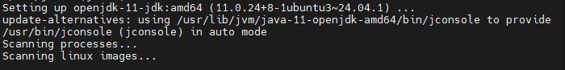

You should see output similar to:

```markdown
openjdk version "11.0.x" 
```
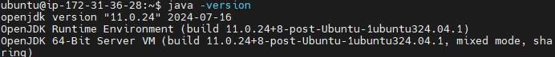

4. Install Jenkins. Jenkins can be installed either from the official package repositories or by downloading the Jenkins WAR file. Installing from a package is the most straightforward way.

```markdown
#Add Jenkins Repository and Key (Ubuntu/Debian)
wget -q -O - https://pkg.jenkins.io/debian/jenkins.io.key | sudo apt-key add -
sudo sh -c 'echo deb http://pkg.jenkins.io/debian-stable binary/ > /etc/apt/sources.list.d/jenkins.list

```
`if that doesn't work, try below `
```markdown
#Install required packages
sudo apt-get update
sudo apt-get install -y ca-certificates curl gnupg
```
```markdown
#Add the GPG Key

curl -fsSL https://pkg.jenkins.io/debian/jenkins.io-2023.key | sudo tee \
  /usr/share/keyrings/jenkins-keyring.asc > /dev/null
```
```markdown
#Add the Jenkins Repository

echo "deb [signed-by=/usr/share/keyrings/jenkins-keyring.asc] https://pkg.jenkins.io/debian binary/" | sudo tee /etc/apt/sources.list.d/jenkins.list > /dev/null
```


```markdown
#install Jenkins
sudo apt update
sudo apt install jenkins -y
```

5. Start and Enable Jenkins at boot

```markdown
sudo systemctl start jenkins

sudo systemctl enable jenkins
```

5. Access Jenkins. Now you can access Jenkins in your browser by navigating to:

```markdown
 http://your-server-ip:8080.
```

6. Get the Initial Admin Password. On your server, run the following command to retrieve the Jenkins unlock key:

```markdown
sudo cat /var/lib/jenkins/secrets/initialAdminPassword
```


#### Step 2. Setup necessary plugins

1. Install Suggested Plugins. After unlocking Jenkins, you'll be prompted to install plugins. You can either install the suggested plugins or select specific plugins as per your needs.

2. Create an Admin User. After the plugins installation, Jenkins will ask you to create the first admin user. Fill in the details and create the account

3.  Configure Jenkins URL. Set the Jenkins root URL to be the server’s IP or domain, so Jenkins can send accurate links in notifications.

Step 3. Configure Jenkins with basic security measures

1. Secure Jenkins.
Securing Jenkins is essential for production use. Here are a few recommendations:

Change the default port to something other than 8080 to reduce potential exposure.


a. Enable HTTPS by setting up an SSL certificate. This can be done via reverse proxy like Nginx or Apache.
b. Set up Role-Based Access Control (RBAC) to manage users and their permissions.
c. Install a Firewall and only allow trusted IP addresses.
d. Backup Jenkins regularly, including the configuration files and job definitions.


### Helm Chart Basics

Prerequisites

1. Kubernetes cluster: Either local (like Kind or Minikube) or on a cloud provider.
2. Helm installed

#### Step 1: Set up Kubernetes Kind cluster

1. Install Docker

```markdown
sudo apt update
sudo apt install docker.io -y
```
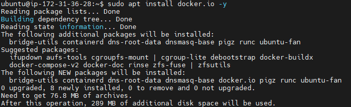

2. Install Kind

```markdown
#Download the binary
curl -Lo ./kind https://kind.sigs.k8s.io/dl/v0.20.0/kind-linux-amd64
chmod +x ./kind
sudo mv ./kind /usr/local/bin/kind
```
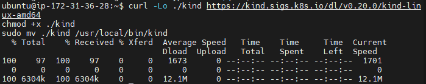

3. Create a cluster. This will create a local Kubernetes cluster in Docker containers.

```markdown
kind create cluster --name jenkins-cluster
```
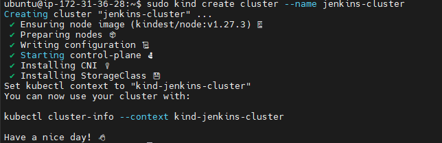

#### Step 2: Set Up Helm

1. Install Helm 

```console
# For Linux/macOS
curl https://raw.githubusercontent.com/helm/helm/master/scripts/get-helm-3 | bash
```
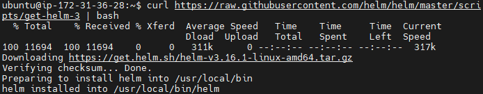

Verify installation

```markdown
helm version
```
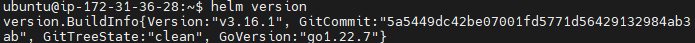

2. Initialize a new Helm chart

Navigate to your project or working directory and run the following command to create a new Helm chart:


```markdown
helm create <chart-name>
```
For example:

```markdown
helm create my-webapp
```
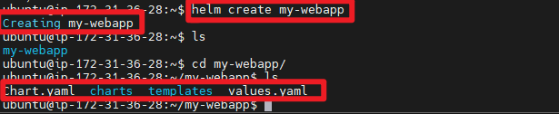

3. This will create a new directory my-webapp with the following structure:

```console
my-webapp/
├── Chart.yaml          # Contains chart metadata (name, version, description)
├── values.yaml         # Default configuration values
├── charts/             # Dependency charts can be added here
├── templates/          # Kubernetes resource templates (e.g., deployment, service)
└── .helmignore         # Files to ignore when packaging the chart
```

### Working With Helm Charts

#### Step 1: Understand the Helm chart structure

1. `chart.yaml`: This file contains the metadata for your Helm chart. You can edit it to provide information about your chart, such as the name, version, description, and maintainers.

```markdown
apiVersion: v2
name: my-webapp
description: A Helm chart for Kubernetes web application
version: 0.1.0
```

2. `values.yaml`: This file contains the default configuration values that your templates use. You can define the resource limits, environment variables, image name, ports, etc., here. It can be overridden during deployment using the --set or --values flags.

3. `templates/`: This folder contains Kubernetes manifests (YAML files) for resources such as Deployments, Services, ConfigMaps, Ingress, etc. The .yaml files here are written using the Go templating engine, allowing dynamic values from values.yaml.

Example of a Kubernetes deployment template (templates/deployment.yaml):
```markdown
apiVersion: apps/v1
kind: Deployment
metadata:
  name: {{ .Values.name }}
spec:
  replicas: {{ .Values.replicaCount }}
  selector:
    matchLabels:
      app: {{ .Values.name }}
  template:
    metadata:
      labels:
        app: {{ .Values.name }}
    spec:
      containers:
      - name: {{ .Values.name }}
        image: "{{ .Values.image.repository }}:{{ .Values.image.tag }}"
        ports:
        - containerPort: {{ .Values.service.port }}
```

#### Step 2: Customize the Helm Chart

1. Edit `values.yaml`
In the `values.yaml` file, you define the default settings for your Helm chart. This includes your application name, replica count, container image, service type, ports, and more. For a basic web application, your values.yaml could look like this:

```markdown
name: my-webapp
replicaCount: 2

image:
  repository: nginx
  tag: latest
  pullPolicy: IfNotPresent

service:
  type: NodePort
  port: 80

ingress:
  enabled: false

resources: {}

nodeSelector: {}

tolerations: []

affinity: {}
```

2. Modify the Deployment Template (`templates/deployment.yaml`)
This file defines the Kubernetes Deployment resource that describes how to run the application.

By default, it uses Go templating to inject values from values.yaml. 

```console
apiVersion: apps/v1
kind: Deployment
metadata:
  name: {{ .Values.name }}
spec:
  replicas: {{ .Values.replicaCount }}
  selector:
    matchLabels:
      app: {{ .Values.name }}
  template:
    metadata:
      labels:
        app: {{ .Values.name }}
    spec:
      containers:
      - name: {{ .Values.name }}
        image: "{{ .Values.image.repository }}:{{ .Values.image.tag }}"
        ports:
        - containerPort: {{ .Values.service.port }}
```
3. Modify the service template. `templates/service.yaml`

```markdown
apiVersion: v1
kind: Service
metadata:
  name: {{ .Values.name }}
spec:
  type: {{ .Values.service.type }}
  ports:
    - port: {{ .Values.service.port }}
      targetPort: 80
  selector:
    app: {{ .Values.name }}
```

#### Step 3: Install the Helm chart.

1. Ensure your Kubernetes cluster is running and you’re connected to it using kubectl.

2. Install helm chart using:

```markdown
helm install my-webapp ./my-webapp
```

3. You can check the status of the release by running:
```markdown
helm list
```

4. Verify the Kubernetes resources created by the Helm chart:

```console
kubectl get all
```

#### Step 4: Upgrade the Helm Chart

If you make changes to your Helm chart (for example, updating the values.yaml), you can upgrade your deployment

```markdown
helm upgrade my-webapp ./my-webapp
```

#### Step 5: Uninstall the Helm Chart
If you want to remove the deployment created by your Helm chart, run the following command:

```markdown
helm uninstall my-webapp
```
#### Step 6: Package and Share Your Chart
Helm charts can be packaged into a .tgz file for easy sharing or deploying in other clusters.

Package your chart:

```markdown
helm package ./my-webapp
```

## Integrating Helm with Jenkins

1. Install Kubernetes plugin

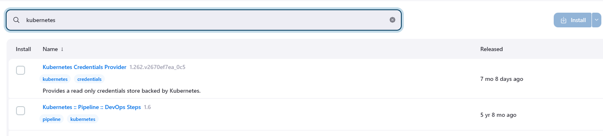

2. Setup pipeline script with SCM or directly 

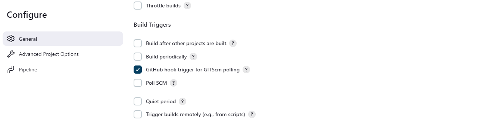
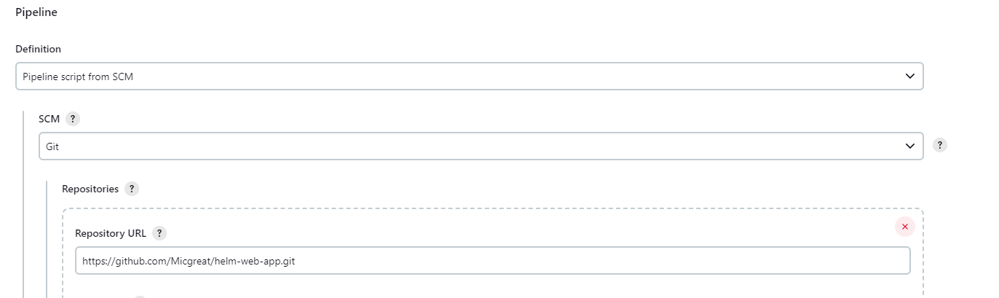

3. Create a jenkinsfile to house the script if SCM is being used 

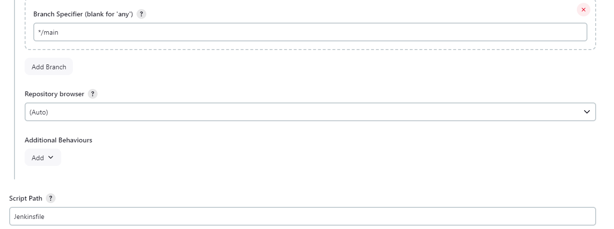

4. Run the build 

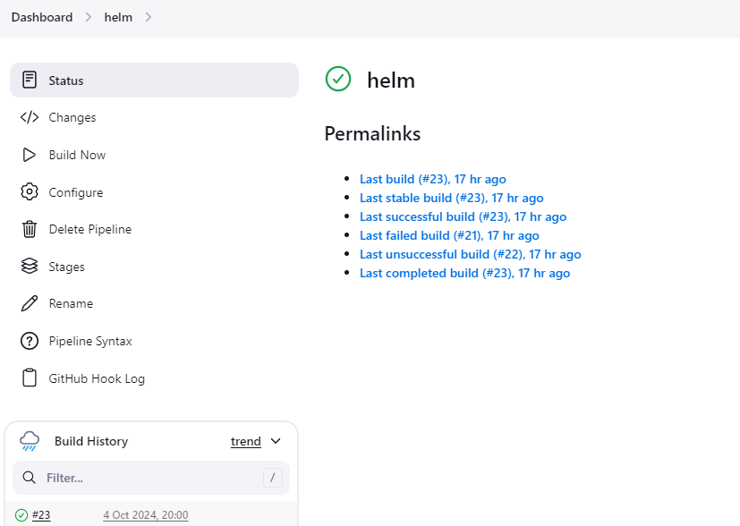
