# Capstone Project #12: E-Commerce Platform with Microservices Architecture

## Project Scenario

I am tasked with developing an e-commerce platform using a microservices-based architecture. The platform consists of several microservices:
1. Product Service: manages product information.
2. Cart Service: handles user shopping carts.
3. Order Service: manages order processing. 

The goal is to containerize these microservices using docker, deploy them to a Kubernetes cluster managed by ArgoCD, and expose them through an API Gateway. 

## Step 1:
1. Create a new directory `ecommerce-platform` and subdirectories for each microservice: `product-service`, `cart-service` and `order-service`. For each microservice, create a `dockerfile` specifying a base image using node.js:

`Dockerfile for product-service`

```markdown
# product-service/Dockerfile
FROM node:18-alpine
WORKDIR /app
COPY package.json package-lock.json ./
RUN npm install
COPY . .
EXPOSE 3001
CMD ["node", "index.js"]
```

2. I created a basic APi for `product-service`

`package.json`
```markdown
{
  "name": "product-service",
  "version": "1.0.0",
  "main": "index.js",
  "scripts": {
    "start": "node index.js"
  },
  "dependencies": {
    "express": "^4.18.2"
  }
}
```

`index.js`
```markdown
const express = require('express');
const app = express();
const PORT = 3001;

const products = [
  { id: 1, name: 'Laptop', price: 1000 },
  { id: 2, name: 'Phone', price: 500 },
  { id: 3, name: 'Tablet', price: 300 }
];

// List all products
app.get('/products', (req, res) => {
  res.json(products);
});

// View product by ID
app.get('/products/:id', (req, res) => {
  const product = products.find(p => p.id === parseInt(req.params.id));
  if (product) {
    res.json(product);
  } else {
    res.status(404).send('Product not found');
  }
});

app.listen(PORT, () => {
  console.log(`Product Service running on port ${PORT}`);
});
```

3. Basic API for `cart-service`

`Dockerfile`
```markdown
# cart-service/Dockerfile
FROM node:18-alpine
WORKDIR /app
COPY package.json package-lock.json ./
RUN npm install
COPY . .
EXPOSE 3002
CMD ["node", "index.js"]
```

`package.json`

```markdown
{
  "name": "cart-service",
  "version": "1.0.0",
  "main": "index.js",
  "scripts": {
    "start": "node index.js"
  },
  "dependencies": {
    "express": "^4.18.2"
  }
}
```

`index.js`
```markdown
const express = require('express');
const app = express();
const PORT = 3002;

let cart = [];

app.use(express.json());

// Add item to cart
app.post('/cart', (req, res) => {
  const item = req.body;
  cart.push(item);
  res.status(201).send('Item added to cart');
});

// Remove item from cart
app.delete('/cart/:id', (req, res) => {
  const itemId = parseInt(req.params.id);
  cart = cart.filter(item => item.id !== itemId);
  res.send('Item removed from cart');
});

// View all items in cart
app.get('/cart', (req, res) => {
  res.json(cart);
});

app.listen(PORT, () => {
  console.log(`Cart Service running on port ${PORT}`);
});
```

4. Basic API for `order-service`

`Dockerfile`
```markdown
# order-service/Dockerfile
FROM node:18-alpine
WORKDIR /app
COPY package.json package-lock.json ./
RUN npm install
COPY . .
EXPOSE 3003
CMD ["node", "index.js"]
```

`package.json`
```markdown
{
  "name": "order-service",
  "version": "1.0.0",
  "main": "index.js",
  "scripts": {
    "start": "node index.js"
  },
  "dependencies": {
    "express": "^4.18.2"
  }
}
```

`index.js`
```markdown
const express = require('express');
const app = express();
const PORT = 3003;

let orders = [];

app.use(express.json());

// Create an order
app.post('/orders', (req, res) => {
  const order = req.body;
  orders.push(order);
  res.status(201).send('Order created');
});

// View all orders
app.get('/orders', (req, res) => {
  res.json(orders);
});

app.listen(PORT, () => {
  console.log(`Order Service running on port ${PORT}`);
});
```

5. Install the needed dependencies and Push to Dockerhub

`npm install`

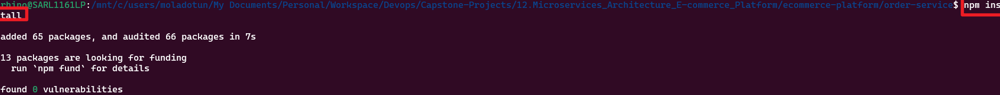

Build and tag for `product-service`

```markdown
cd ecommerce-platform/product-service
docker build -t micgreat/product-service:latest .
```
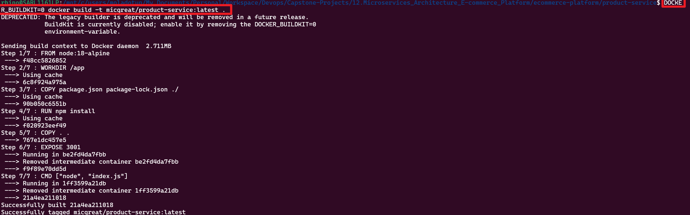


`npm install`


Build and tag for `cart-service`

```markdown
cd ecommerce-platform/cart-service
docker build -t micgreat/cart-service:latest .
```
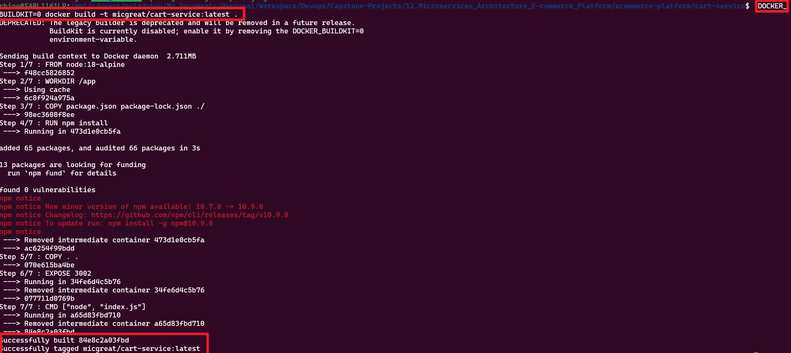

`npm install`


Build and tag for `order-service`

```markdown
cd ecommerce-platform/order-service
docker build -t micgreat/order-service:latest .
```
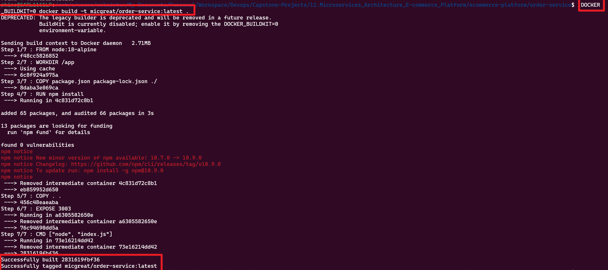

All services running 
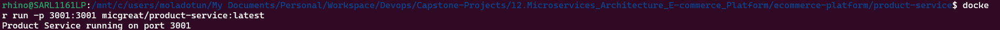
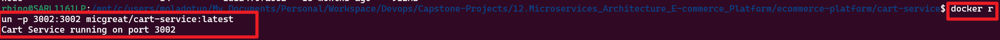
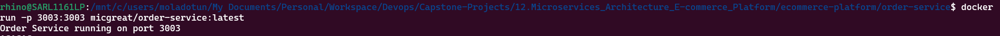


#### Push to Dockerhub

```markdown
docker push micgreat/product-service:latest
```

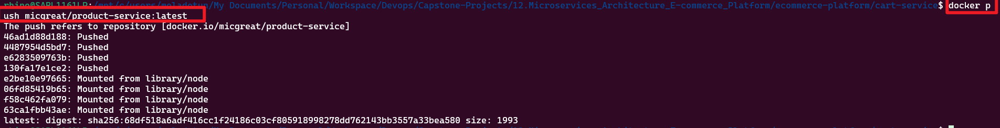
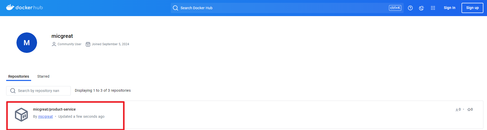

## Step 2: Set up Argocd with Kubernetes

1. Set up the kubernetes cluster

```markdown
kind create cluster
```
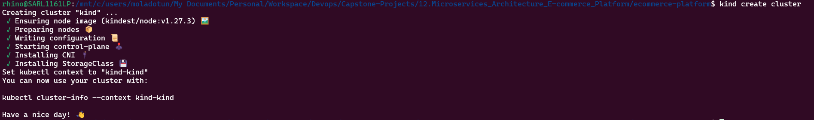

2. Create argocd namespace

```markdown
kubectl create namespace argocd
```

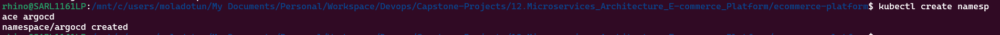

3. Install argocd in the cluster

```markdown
kubectl apply -n argocd -f https://raw.githubusercontent.com/argoproj/argo-cd/stable/manifests/install.yaml
```
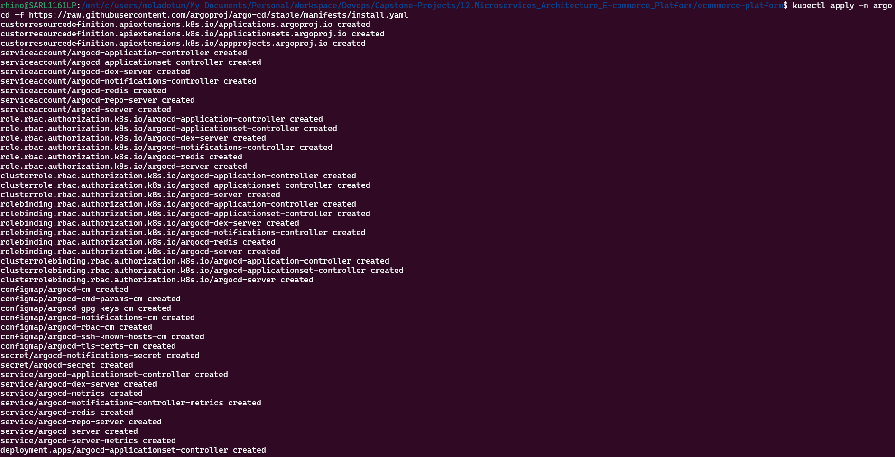

4. Verify argocd components are running

```markdown
kubectl get pods -n argocd
```
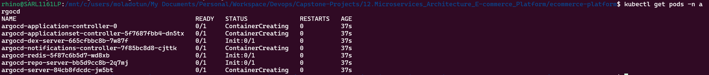

- view Argocd

```markdown
kubectl port-forward svc/argocd-server -n argocd 8081:443
```

- add git user to argo

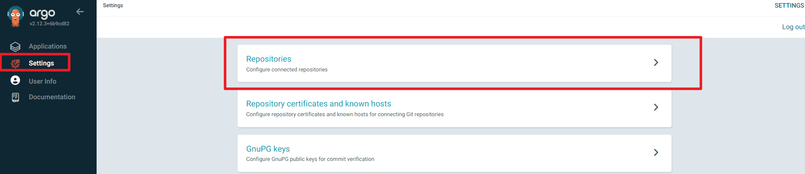
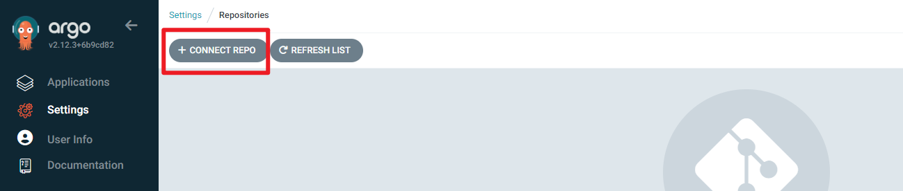
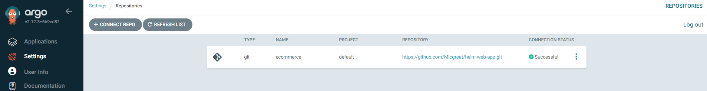

5. Kubernetes Deployment

- Create Kubernetes deployment YAML file for each microservice

`cart-service/cart-service-deployment.yaml`
```markdown
apiVersion: apps/v1
kind: Deployment
metadata:
  name: cart-service
  namespace: argocd
spec:
  replicas: 3
  selector:
    matchLabels:
      app: cart-service
  template:
    metadata:
      labels:
        app: cart-service
    spec:
      containers:
        - name: cart-service
          image: micgreat/cart-service:latest
          ports:
            - containerPort: 3002
          env:
            - name: NODE_ENV
              value: "production"
---
apiVersion: v1
kind: Service
metadata:
  name: cart-service
  namespace: argocd
spec:
  type: ClusterIP
  ports:
    - port: 3002
      targetPort: 3002
  selector:
    app: cart-service
```

`order-service/cart-service-deployment.yaml`

```markdown
apiVersion: apps/v1
kind: Deployment
metadata:
  name: order-service
  namespace: argocd
spec:
  replicas: 3
  selector:
    matchLabels:
      app: order-service
  template:
    metadata:
      labels:
        app: order-service
    spec:
      containers:
        - name: order-service
          image: micgreat/order-service:latest
          ports:
            - containerPort: 3003
          env:
            - name: NODE_ENV
              value: "production"
---
apiVersion: v1
kind: Service
metadata:
  name: order-service
  namespace: argocd
spec:
  type: ClusterIP
  ports:
    - port: 3003
      targetPort: 3003
  selector:
    app: order-service
```

`product-service/product-service-deployment.yaml`

```markdown
apiVersion: apps/v1
kind: Deployment
metadata:
  name: product-service
  namespace: argocd
spec:
  replicas: 3
  selector:
    matchLabels:
      app: product-service
  template:
    metadata:
      labels:
        app: product-service
    spec:
      containers:
        - name: product-service
          image: micgreat/product-service:latest
          ports:
            - containerPort: 3001
          env:
            - name: NODE_ENV
              value: "production"
---
apiVersion: v1
kind: Service
metadata:
  name: product-service
  namespace: argocd
spec:
  type: ClusterIP
  ports:
    - port: 3001
      targetPort: 3001
  selector:
    app: product-service
```

```markdown
kubectl apply -f product-service-deployment.yaml
kubectl apply -f cart-service-deployment.yaml
kubectl apply -f order-service-deployment.yaml
```

- Define the argocd application YAML to manage these deployments. 

`cart-service-application.yaml`
```markdown
apiVersion: argoproj.io/v1alpha1
kind: Application
metadata:
  name: cart-service
  namespace: argocd
spec:
  project: default
  source:
    repoURL: 'https://github.com/Micgreat/helm-web-app.git'  # Replace with your repo URL
    targetRevision: HEAD
    path: ecommerce-platform/cart-service  # Path to your cart-service deployment YAML
  destination:
    server: 'https://kubernetes.default.svc'
    namespace: ecommerce  # Replace with your target namespace
  syncPolicy:
    automated:
      prune: true
      selfHeal: true
```

`product-service-application.yaml`

```markdown
apiVersion: argoproj.io/v1alpha1
kind: Application
metadata:
  name: product-service
  namespace: argocd
spec:
  project: default
  source:
    repoURL: 'https://github.com/Micgreat/helm-web-app.git'  # Replace with your repo URL
    targetRevision: HEAD
    path: ecommerce-platform/product-service  # Path to your product-service deployment YAML
  destination:
    server: 'https://kubernetes.default.svc'
    namespace: ecommerce  # Replace with your target namespace
  syncPolicy:
    automated:
      prune: true
      selfHeal: true
```

`order-service-application.yaml`

```markdown
apiVersion: argoproj.io/v1alpha1
kind: Application
metadata:
  name: order-service
  namespace: argocd
spec:
  project: default
  source:
    repoURL: 'https://github.com/Micgreat/helm-web-app.git'  # Replace with your repo URL
    targetRevision: HEAD
    path: ecommerce-platform/order-service  # Path to your order-service deployment YAML
  destination:
    server: 'https://kubernetes.default.svc'
    namespace: ecommerce  # Replace with your target namespace
  syncPolicy:
    automated:
      prune: true
      selfHeal: true
```


```markdown
kubectl apply -f cart-service-application.yaml
kubectl apply -f product-service-application.yaml
kubectl apply -f order-service-application.yaml
```

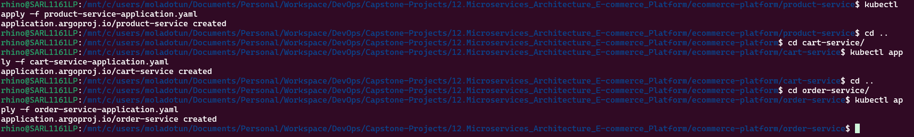

- Create kubernetes service YAML files for each microservice, specifying the type as `ClusterIP`

`cart-service-service.yaml`

```markdown
apiVersion: v1
kind: Service
metadata:
  name: cart-service
  namespace: ecommerce  # Replace with your target namespace
spec:
  type: ClusterIP
  ports:
    - port: 3002       # The port that will be exposed internally
      targetPort: 3002 # The port on the container to forward traffic to
  selector:
    app: cart-service  # Label selector to target the deployment
```

`product-service-service.yaml`

```markdown
apiVersion: v1
kind: Service
metadata:
  name: product-service
  namespace: argocd  # Replace with your target namespace
spec:
  type: ClusterIP
  ports:
    - port: 3001       # The port that will be exposed internally
      targetPort: 3001 # The port on the container to forward traffic to
  selector:
    app: product-service  # Label selector to target the deployment
```

`order-service-service.yaml`

```markdown
apiVersion: v1
kind: Service
metadata:
  name: order-service
  namespace: argocd  # Replace with your target namespace
spec:
  type: ClusterIP
  ports:
    - port: 3003       # The port that will be exposed internally
      targetPort: 3003 # The port on the container to forward traffic to
  selector:
    app: order-service  # Label selector to target the deployment
```

```markdown
kubectl apply -f cart-service-service.yaml
kubectl apply -f product-service-service.yaml
kubectl apply -f order-service-service.yaml
```

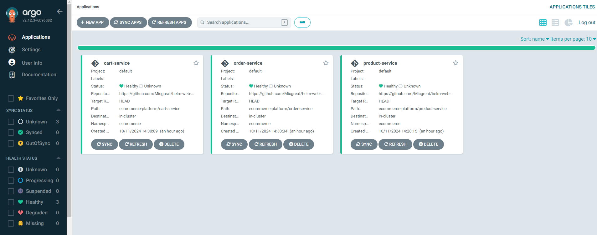

## Step 3: API Gateway Integration

```markdown
# Add the Kong Helm repository
helm repo add kong https://charts.konghq.com

# Update Helm repositories
helm repo update

# Install Kong using Helm (this installs both Kong and the Ingress Controller)
helm install kong kong/kong --namespace kong --create-namespace
```
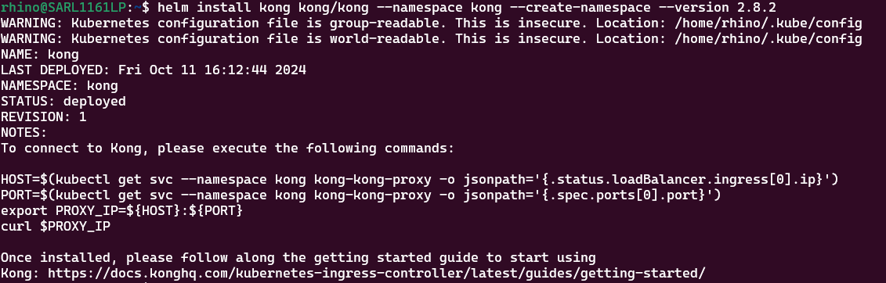
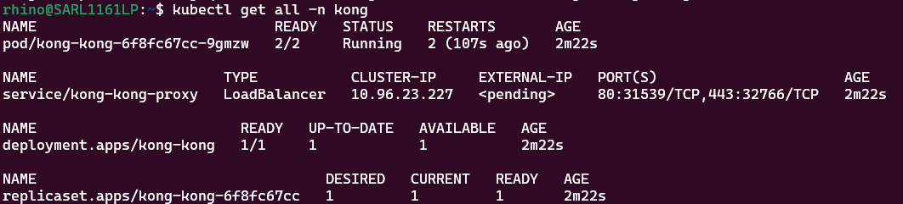


cygVyb8W3a4hxJ2P