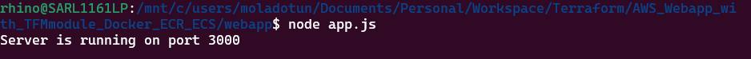

# Dynamic Web App on AWS with Terraform Module, Docker, Amazon ECR, and ECS

I used terraform to create a moular infrsatructure for hosting a dynamic web app on Amazon ECS, I containerized the web app using Docker, pushed the docker image to Amazon ECR and deployed the app on ECS. 

For this project, I didn't create a frontend for the webapp (client-side), only a backend using node.js.

## Task 1: Dockerization of Web App

1. I created a dynamic web application using Node.js doing the following:

2. Created a directory `webapp` and cd into it. 

```markdown
mkdir webapp
cd webapp

```
3. Initialized node.js backend technology (server-side) into the directory, which in turn updated the `package.json` file.

```markdown
npm init -y
```

4. I installed the `express.js` runtime framework needed for the backend.

```markdown
npm install express
```
5. Setup a file `app.js` to paste the node.js code into it.

```markdown
const express = require('express');
const app = express();
const PORT = process.env.PORT || 3000;

app.get('/', (req, res) => {
    res.send('Hello, World! This is a Dockerized web app.');
});

app.listen(PORT, () => {
    console.log(`Server is running on port ${PORT}`);
});
```

6. I tested the application and ran it locally, using the command below and it worked perfectly.

```markdown
node app.js
```




7. I created a dockerfile, to build a docker image

```markdown
# Use the official Node.js image from Docker Hub
FROM node:14

# Create a working directory for the app
WORKDIR /usr/src/app

# Copy package.json and package-lock.json to the working directory
COPY package*.json ./

# Install the app dependencies
RUN npm install

# Copy the rest of your application code
COPY . .

# Expose the port your app runs on
EXPOSE 3000

# Command to run the app
CMD ["node", "app.js"]
```

```markdown
docker build -t webapp .
```
```markdown
docker run -p 3000:3000 webapp
```

## Task 2: Terraform Module for Amazon ECR

I created an ECR module and placed it in the repo `trfm-ecs-webapp/modules/ecr/main.tf` 