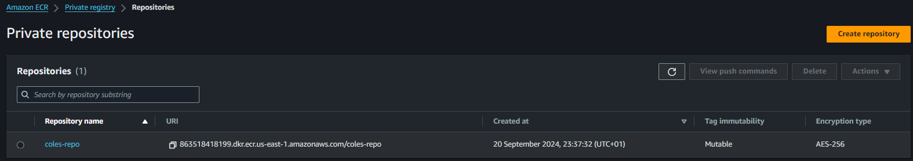
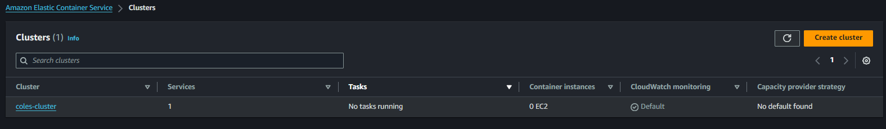

# Dynamic Web App on AWS with Terraform Module, Docker, Amazon ECR, and ECS

I used terraform to create a moular infrsatructure for hosting a dynamic web app on Amazon ECS, I containerized the web app using Docker, pushed the docker image to Amazon ECR and deployed the app on ECS. 

For this project, I didn't create a frontend for the webapp (client-side), only a backend using node.js.

## Task 1: Dockerization of Web App

1. I created a dynamic web application using Node.js doing the following:

2. Created a directory `webapp` and cd into it. 

```markdown
mkdir webapp
cd webapp

```
3. Initialized node.js backend technology (server-side) into the directory, which in turn updated the `package.json` file.

```markdown
npm init -y
```

4. I installed the `express.js` runtime framework needed for the backend.

```markdown
npm install express
```
5. Setup a file `app.js` to paste the node.js code into it.

```markdown
const express = require('express');
const app = express();
const PORT = process.env.PORT || 3000;

app.get('/', (req, res) => {
    res.send('Hello, World! This is a Dockerized web app.');
});

app.listen(PORT, () => {
    console.log(`Server is running on port ${PORT}`);
});
```

6. I tested the application and ran it locally, using the command below and it worked perfectly.

```markdown
node app.js
```


7. I created a dockerfile, to build a docker image

```markdown
# Use the official Node.js image from Docker Hub
FROM node:14

# Create a working directory for the app
WORKDIR /usr/src/app

# Copy package.json and package-lock.json to the working directory
COPY package*.json ./

# Install the app dependencies
RUN npm install

# Copy the rest of your application code
COPY . .

# Expose the port your app runs on
EXPOSE 3000

# Command to run the app
CMD ["node", "app.js"]
```

```markdown
docker build -t webapp .
```
```markdown
docker run -p 3000:3000 webapp
```

## Task 2: Terraform Module for Amazon ECR

1. I created an ECR and ECS module and placed it in the repo `trfm-ecs-webapp/modules/ecr&ecs/main.tf` 

`modules/ecr/main.tf`

```markdown
resource "aws_ecr_repository" "this" {
  name                 = "coles-repo"
  image_tag_mutability = "MUTABLE"  # or "IMMUTABLE" based on your requirements


  # Optionally enable scanning on push
  image_scanning_configuration {
    scan_on_push = true
  }
}
```

`modules/ecs/main.tf`

```markdown
resource "aws_ecs_cluster" "foo" {
  name = "coles-cluster"

}
```

`trfm-ecs-webapp-main.tf`

```markdown
provider "aws" {
  region = "us-east-1"  # Change to your desired region
}

module "ecr" {
  source          = "./modules/ecr"
}

module "ecs" {
  source      = "./modules/ecs"
}
```
2. I ran terraform using 

```markdown
terraform init    # Initializes Terraform, downloading necessary providers
terraform plan    # Creates an execution plan
terraform apply   # Applies the changes to create the ECS cluster

```

## Task 3: Push to ECR and ECS

1. Tag the docker image to the ECR just created

```markdown
docker tag my-image:latest aws_account_id.dkr.ecr.us-east-1.amazonaws.com/my-repo:latest

my-image: The name of your Docker image.
aws_account_id: Your actual AWS account ID.
us-east-1: The region where your ECR repository is located.
my-repo: The name of your ECR repository.
```

2. Push the Docker Image to ECR

```markdown
docker push aws_account_id.dkr.ecr.us-east-1.amazonaws.com/my-repo:latest

aws_account_id: Your actual AWS account ID.
my-repo: The name of your ECR repository.
```


3. ECS needs a task definition json file which I created. `task-def.json`

```markdown
{
    "family": "my-task-family",
    "networkMode": "bridge",
    "containerDefinitions": [
      {
        "name": "my-container",
        "image": "aws-account-id-number.dkr.ecr.us-east-1.amazonaws.com/coles-repo:latest",
        "memory": 512,
        "cpu": 256,
        "essential": true,
        "portMappings": [
          {
            "containerPort": 80,
            "hostPort": 80
          }
        ]
      }
    ]
  }
  
```

4. I registered the task definition using the AWS CLI

```markdown
aws ecs register-task-definition --cli-input-json file://task-def.json
```

5. I  created the service file for the cluster directly the `modules/ecs/main.tf` file

```markdown
resource "aws_ecs_task_definition" "my_task" {
  family                   = "my-task-family"
  network_mode            = "awsvpc"  # or "bridge"
  requires_compatibilities = ["EC2"]  # or "FARGATE"

  container_definitions = jsonencode([{
    name      = "my-container"
    image     = "aws-account-id-number.dkr.ecr.us-east-1.amazonaws.com/coles-repo:latest"
    memory    = 512
    cpu       = 256
    essential = true
    portMappings = [{
      containerPort = 80
      hostPort      = 80
    }]
  }])
}

resource "aws_ecs_service" "my_service" {
  name            = "my-service"
  cluster         = aws_ecs_cluster.foo.id
  task_definition = aws_ecs_task_definition.my_task.id
  desired_count   = 1

  launch_type = "EC2"  # or "FARGATE"

  network_configuration {
    subnets          = ["subnet-xxxfb"]  # Add your subnet IDs
    security_groups  = ["sg-xxxx"]      # Add your security group ID
    assign_public_ip = false
  }
}
```
